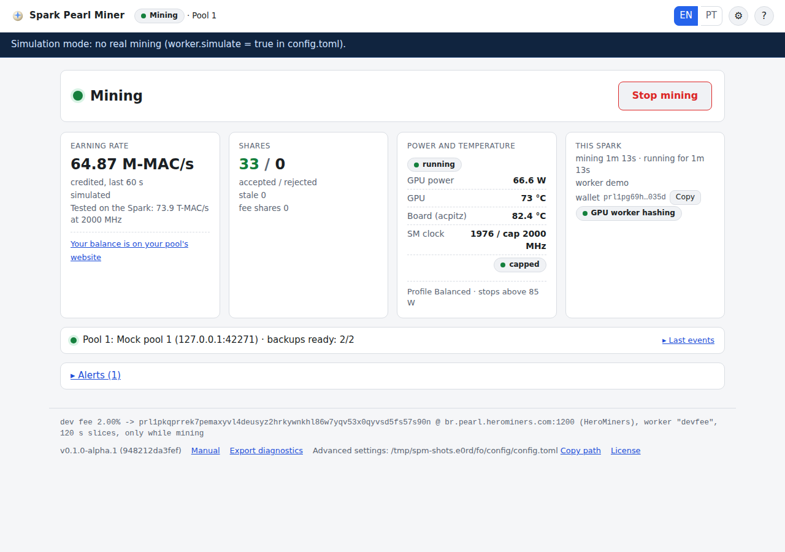
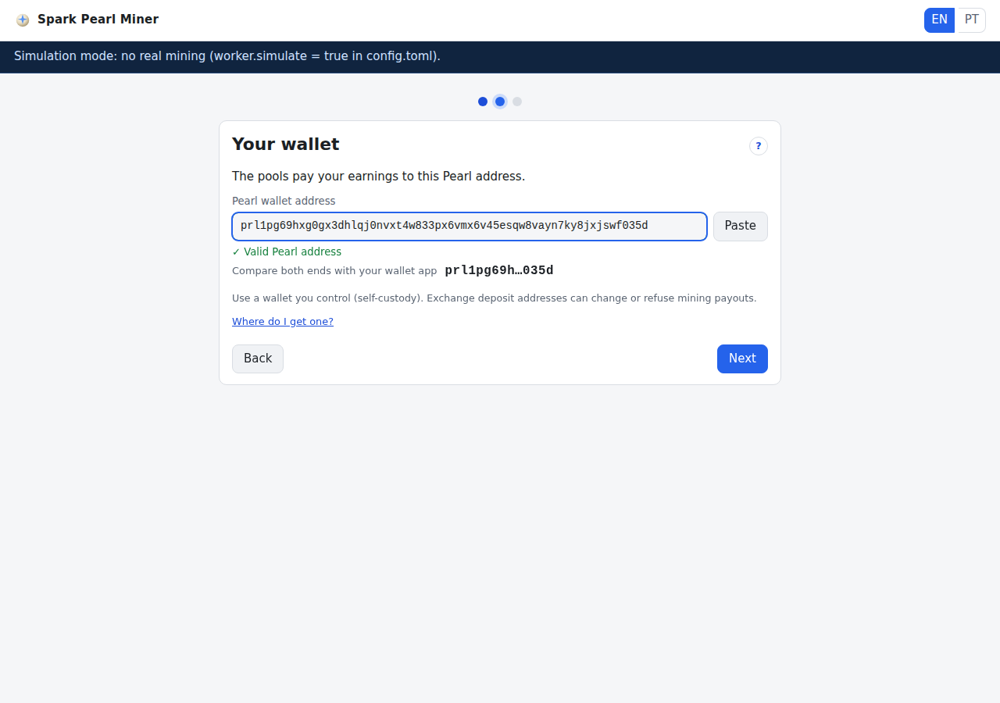

# Spark Pearl Miner

**Earn Pearl (PRL) with your NVIDIA DGX Spark while it would otherwise sit idle, at low power.**
Open source (Apache-2.0), built only for the DGX Spark (GB10). Unofficial: not affiliated with,
sponsored by, or endorsed by NVIDIA or Pearl Research Labs.
_Português: [README.pt-BR.md](README.pt-BR.md)_

> **Status:** mining on mainnet pools (Kryptex, HeroMiners BR, LuckyPool BR) with accepted shares ·
> pre-release **0.1.0-alpha.1**.

## Why

A DGX Spark spends most of its time waiting for the next job. This miner puts that idle GPU to work
on Pearl (PRL), a proof-of-useful-work coin whose "hash" is an INT8 matrix multiplication, which is
exactly what the GB10's tensor cores are good at.

On the DGX Spark, with the default 2000 MHz clock cap, it sustains **73.9 T-MAC/s** of credited work
at **about 63 W of GPU power**, with the GPU at **72 °C**: well below the ~88–92 W at which the
Spark is known to power off. The credited rate moves in steps because the pool credits whole
attempts (7.04e13 MACs each).

What that earns depends on the network difficulty and the PRL price, which both move fast. At the
**2026-09-26 snapshot** in [VIABILITY](docs/en/VIABILITY.md) (difficulty 29.4 M, 0.0241 PRL per
TH/s per day, PRL at US$1.30), 73.9 T-MAC/s is about **1.8 PRL/day gross**, before the 2 %
developer fee and the pool's own fee. Difficulty rose 36 % in the 30 days before that snapshot, so
expect less over time. Your pool's website shows what you really earn. This is not financial
advice.


_The dashboard. Simulated values: the manual's pictures come from a simulated miner._

## Install

On the DGX Spark, in a terminal, as your normal user (not root):

**1. Install.** One command:

```bash
curl -fsSL https://raw.githubusercontent.com/xXGuilasXx/spark-pearl-miner/main/packaging/install.sh | bash
```

The installer checks the machine (aarch64, GB10, NVIDIA driver ≥ 580, the CUDA 13 runtime),
downloads the newest release and checks it against its `SHA256SUMS` (until the first release is
published it builds from source instead, 5–15 minutes), installs `~/.local/bin/spark-pearl-miner`,
a systemd user service and an app-menu entry, and starts the service. Before that it asks two
questions, both answered **Yes** by pressing Enter, that need your password once (`sudo`):

- **Install the 2000 MHz GPU clock cap?** Recommended: the safety net that keeps the GPU at about
  63 W, far from the ~88–92 W at which the Spark powers off (reversible).
- **Keep mining after you log out and start at boot?** (lingering)

It never touches your settings, and a fresh install does not mine yet.

**2. Open the GUI.** The installer opens it; otherwise use **Spark Pearl Miner** in the app menu, run
`spark-pearl-miner gui`, or open **http://127.0.0.1:4078/**.

**3. Three answers.** Pick your language, paste your Pearl wallet address (`prl1p…`), accept the
2 % developer fee, and press **Start mining**.



**If you answered No to the clock cap** (or the installer had no terminal to ask on, or you used
`--no-sudo`), the GPU is not capped until you run this once, before you press **Start mining**:

```bash
sudo ~/.local/share/spark-pearl-miner/install-clockcap.sh --apply
```

The installer's summary, the last setup step and the dashboard show this command while the cap is
missing. Lingering later: `sudo loginctl enable-linger $USER`. `--yes` answers both questions with
yes.

- **It keeps running.** The service starts with your session (or at boot with lingering). It mines
  only after the setup and **Start**; **Stop** is remembered across reboots.
- **Update:** `~/.local/share/spark-pearl-miner/install.sh --upgrade` (settings are kept; if the new
  version refuses your settings, the old one is put back). Go back:
  `~/.local/share/spark-pearl-miner/install.sh --rollback`.
- **Uninstall:** `~/.local/share/spark-pearl-miner/install.sh --uninstall` (add `--purge` to also
  delete the settings, wallet and token).
- **From source:** `git clone --recurse-submodules https://github.com/xXGuilasXx/spark-pearl-miner && cd spark-pearl-miner && ./packaging/install.sh --from-source`.
- **Headless / remote:** `ssh -L 4078:127.0.0.1:4078 you@your-spark`, then open
  http://127.0.0.1:4078/ on your computer.

Every installer option: `packaging/install.sh --help`.

## What you will see

One page answers three questions: **is it working** (one sentence with a coloured dot and one
Start/Stop button), **how much** (the credited rate and the accepted/rejected shares) and **is it
safe** (GPU power, GPU and board temperatures, SM clock and the clock cap). One line under it shows
which pool is in use and whether the backups are ready. The gear icon holds the only four settings
you may want to change: wallet, worker name, language and the three pools. `spark-pearl-miner status`
does the same from a terminal.

The **[illustrated manual](docs/en/MANUAL.md)** explains every button, message and setting, with a
picture of each screen.

## Developer fee (disclosed)
`dev fee 2.00% → prl1pkqprrek7pemaxyvl4deusyz2hrkywnkhl86w7yqv53x0qyvsd5fs57s90n @ br.pearl.herominers.com:1200 (HeroMiners), worker "devfee", 120 s slices, only while mining`
All fee constants live in one file, `crates/spm-fee/src/lib.rs`; CI fails if this README disagrees with it. **The fee wallet is not configurable**: there is no flag, environment variable, config key or API that can change it, and the GUI shows it read-only. Release tarballs ship with a SHA256SUMS file; reproducible, attested builds are planned but not in place yet. No remote configuration, no obfuscation, no packed binaries. The fee switches itself off when your wallet is the fee wallet.

## Donations
If this project is useful to you, PRL donations are welcome at the same address:

`prl1pkqprrek7pemaxyvl4deusyz2hrkywnkhl86w7yqv53x0qyvsd5fs57s90n`

## Pools
The miner ships with three pools, in this order, and automatic failover between them:
**Kryptex** (`prl-br.kryptex.network:8048`, TLS), **HeroMiners BR** (`br.pearl.herominers.com:1200`)
and **LuckyPool BR** (`pearl-br.luckypool.io:3360`, pinned certificate). All three had accepted
shares and 0 rejects in live tests. If the pool in use fails, the miner switches to the next one in
about 1 s; it checks the preferred pool again every 5 minutes and returns to it once it has been
stable for 60 s. The dashboard shows this as one status line. Change the pools with the gear icon (see
`docs/en/CONFIGURATION.md` for every pool option). If you still have to pick one: I have mined PRL on **Kryptex** and never had a problem with its payouts. Signing up through my referral link costs you nothing and supports this project:

https://pool.kryptex.com/?ref=b2cfe3e2 (referral link)

## Safety

- **Power.** The GB10 has no software power limit and some units power off hard around 88–92 W of
  GPU draw. The default **Balanced** profile targets 75 W and stops at 85 W, with the 2000 MHz clock
  cap (measured about 63 W). A governor reads the GPU 10 times per second and pauses mining when the
  GPU passes 83 °C, the board passes 95 °C, or the power stays above the stop for 3 readings (60 s
  pause). Without power readings it does not mine. The Max profile (2200 MHz) measured 83–87 W and a
  97.5 °C board, so it exists only in the settings file behind an explicit acknowledgement and is
  not recommended. Details: [POWER-THERMAL](docs/en/POWER-THERMAL.md).
- **Memory.** The GPU worker uses at most 2 GiB. It starts only with 22 GiB free and frees the GPU at
  once below 16 GiB or under memory pressure, so your other programs come first.
- **Shares.** Every share is verified on the Spark with the official Pearl reference code before it
  is sent.
- **Access.** The GUI listens on 127.0.0.1 only. Your own user needs no password; other accounts and
  remote users need the token (`spark-pearl-miner gui --print-url`); LAN exposure is refused.

## Settings file

Everything not in the GUI lives in one file, `~/.config/spark-pearl-miner/config.toml`, already
tuned for the Spark and commented. Edit it only if you know why: the miner applies valid edits
within seconds, ignores invalid ones (the dashboard shows an alert), and
`spark-pearl-miner config check` tells you what is wrong. Every key:
[CONFIGURATION](docs/en/CONFIGURATION.md).

## FAQ

**Does it slow down my AI work?** By default the GPU is the miner's while it mines: press **Stop**
(the GPU is freed at once) before you run a model, **Start** afterwards. To have it step aside by
itself while vLLM is busy, set `coexistence.mode = "yield"` in the settings file
([COEXISTENCE](docs/en/COEXISTENCE.md)). In every mode it frees the GPU when memory runs low.

**What if the pool is down?** It switches to the next pool in about 1 s and comes back when the
first one has been healthy for 60 s (it is checked every 5 minutes). If all three are down it keeps retrying and the dashboard says so.

**How do I stop, update or uninstall?** Stop: the button on the dashboard, or
`spark-pearl-miner stop`. Update, rollback and uninstall: see [Install](#install).

**Where is the configuration? Where are the logs?** `~/.config/spark-pearl-miner/config.toml`
(`spark-pearl-miner config path`). Logs: `journalctl --user -u spark-pearl-miner -f`, or **Export
diagnostics** in the dashboard footer.

**Do I need root?** Only for the two optional steps: the clock cap and lingering.

**Why does the rate move in steps?** The pool credits whole attempts of 7.04e13 MACs.

**Can I change the fee or the fee wallet?** No. It is compiled in and shown read-only.

**How do I pause or pin a pool?** From the command line or the API; see the
[manual](docs/en/MANUAL.md#cli).

**Is this financial advice?** No. Mining income is taxable in many countries (in Brazil, IN RFB
2291/2025).

## Requirements

An NVIDIA DGX Spark (GB10) with DGX OS 7.x (driver ≥ 580 and the CUDA 13 runtime, both
preinstalled) and a Pearl wallet address (`prl1p…`) that you control. Rust is needed only to build
from source (pinned 1.98.1, installed automatically by the installer).

## Documentation

For users: [Manual (illustrated)](docs/en/MANUAL.md) · [Configuration](docs/en/CONFIGURATION.md) ·
[Power and thermal](docs/en/POWER-THERMAL.md) · [Coexistence with an LLM server](docs/en/COEXISTENCE.md) ·
[Viability](docs/en/VIABILITY.md)

## Development

[Architecture](docs/en/ARCHITECTURE.md) · [Kernel contract](docs/en/KERNEL.md) ·
[Benchmarks](docs/en/BENCHMARKS.md) · [Pool protocols](docs/protocol/) ·
[Decisions](docs/en/DECISIONS.md) · [Dual mining verdict](docs/en/DUAL-MINING.md) ·
[API and security reference](docs/en/GUI.md) · [TODO](TODO.md) · [Contributing](CONTRIBUTING.md)

The screenshots are regenerated with `tools/screenshots.sh`; the installer is tested with
`tools/test-install.sh`, and release tarballs are built with `packaging/make-release.sh`.

## License
Apache-2.0 — see [LICENSE](LICENSE) and [NOTICE](NOTICE) (ISC: Pearl Research Labs and The Decred developers; BSD-3: NVIDIA CUTLASS).
