# Spark Pearl Miner: user manual

_Português: [../pt-BR/MANUAL.md](../pt-BR/MANUAL.md)_

This manual covers everything you can see in the miner's web interface (the GUI): the three setup
steps, the dashboard, the Settings dialog, the sign-in screen, every message the GUI can show,
and the one settings file for what the GUI does not show. Each screen has a picture.

**Contents**

0. [About the pictures](#about-the-pictures)
1. [Opening the miner](#opening)
2. [First run: the three setup steps](#first-run)
3. [The dashboard](#dashboard)
4. [The Settings dialog](#settings)
5. [The sign-in screen](#login)
6. [The advanced settings file](#advanced-file)
7. [Command-line equivalents](#cli)
8. [Where to see your balance](#balance)
9. [Troubleshooting](#troubleshooting)
10. [Update, rollback and uninstall](#update)

<a id="about-the-pictures"></a>
## 0. About the pictures

Every picture in this manual was taken from a **simulated** miner (`worker.simulate = true`) with
mock pools on the same computer, so none of them shows real mining. That is why:

- a dark blue bar at the top reads **"Simulation mode: no real mining (worker.simulate = true in
  config.toml)."** You never see this bar on a real miner;
- the earning rate is tiny (M-MAC/s instead of about 74 T-MAC/s) and the card says *simulated*;
- the pools are called "Mock pool 1/2" at `127.0.0.1`, and the settings path in the footer is a
  temporary folder instead of `~/.config/spark-pearl-miner/config.toml`;
- the wallet shown (`prl1pg69h…035d`) is a valid placeholder that belongs to nobody.

The pictures are regenerated with `tools/screenshots.sh` (see the header of that script). English
pictures live in `docs/images/en/`, Portuguese ones in `docs/images/pt-BR/`.

<a id="opening"></a>
## 1. Opening the miner

The miner is a background service (`spark-pearl-miner`, a systemd user service) that runs all the
time. The GUI is a web page that it serves only on this computer, at **http://127.0.0.1:4078/**.

| How | What happens |
|---|---|
| App menu → **Spark Pearl Miner** | opens the GUI in your browser |
| `spark-pearl-miner gui` in a terminal | the same; it also starts the service if it is not running |
| type `http://127.0.0.1:4078/` in the browser | the same, when you are logged in on the Spark as the user that installed the miner |
| `spark-pearl-miner gui --print-url` | prints a link that carries the access token (for another account or remote access) |

**From another computer.** The GUI never listens on the network. Forward the port over SSH and open
the page on your own computer:

```bash
ssh -L 4078:127.0.0.1:4078 you@your-spark
# then open http://127.0.0.1:4078/ on this computer
```

Keep 4078 on both ends. Because the tunnel runs as your user on the Spark, the GUI opens without a
token; if it asks for one, see [the sign-in screen](#login).

<a id="first-run"></a>
## 2. First run: the three setup steps

While no wallet is saved, or the developer fee has not been accepted, the GUI shows the setup
instead of the dashboard. It has three steps, shown as three dots at the top (the current dot is
highlighted, finished dots are filled). The header shows only the name and the **EN / PT** switch.

Nothing is saved until the last button, **Start mining**. You can go **Back** at any time; what you
typed is kept, even if you change the language. Each step has a small **?** button in its corner
that opens the matching part of this manual.

Everything that is not asked here (pools, failover timing, power limits, GPU sharing, the local
API, the worker name) comes already tuned for the DGX Spark. You can change the wallet, the worker
name, the language and the pools later with the gear icon ([Settings](#settings)).

<a id="wizard-1"></a>
### Step 1: Welcome / language

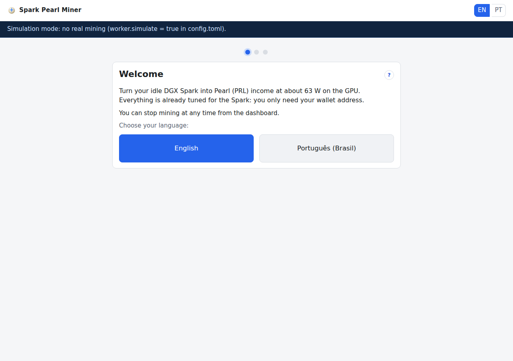

| Element | What it does |
|---|---|
| **Welcome** and the text below it | a short introduction: the miner turns the idle Spark into Pearl (PRL) income at about 63 W on the GPU, and you only need your wallet address |
| "You can stop mining at any time from the dashboard." | a reminder; stopping is one button (see [the main button](#main-button)) |
| **English** / **Português (Brasil)** | picks the language of the GUI and goes to step 2. The button that matches your browser's language is highlighted (blue) |

The choice is saved as `gui.language` when you press **Start mining** in step 3.

<a id="wizard-2"></a>
### Step 2: Your wallet


| Element | What it does |
|---|---|
| **Pearl wallet address** box | paste the address of your own Pearl wallet (`prl1p…`, 63 characters). It is checked as you type |
| **Paste** | pastes from the clipboard. It appears only when the browser allows the page to read the clipboard |
| ✓ **Valid Pearl address** | the address passed every check (format, characters and checksum) |
| **Compare both ends with your wallet app** `prl1pxxxx…yyyy` | the first 9 and the last 4 characters. Check that they match what your wallet app shows: this catches a wrong copy or a clipboard hijacker |
| "Use a wallet you control (self-custody)…" | exchange deposit addresses can change, or refuse mining payouts; use a wallet whose keys you hold |
| **Where do I get one?** | opens [the wallet section](#wallet) below |
| **Back** / **Next** | **Next** stays grey until the address is valid |

When you leave the box, spaces around the address are removed and an address written in capitals
is converted to lower case (both are the same address).

If you paste the developer's own fee address, a note says **"This is the developer's fee wallet:
the fee switches itself off when you mine to it."**

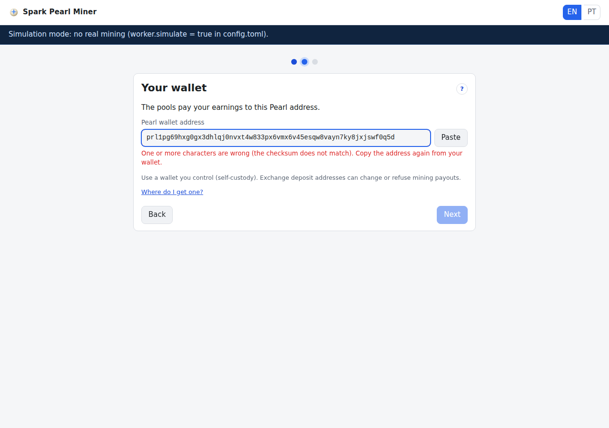

The red messages under the box, and what to do:

| Message | Meaning / what to do |
|---|---|
| Enter your Pearl wallet address. | the box is empty |
| The address mixes upper and lower case. Copy it again from your wallet. | an address is either all lower case or all upper case; copy it again |
| This is longer than a Pearl address. Copy only the address. | you probably copied extra text with it |
| This does not look like a Pearl address: it must start with prl1p | not an address at all, or the beginning is missing |
| It contains a character that Pearl addresses never use (b, i, o, or a symbol). Copy the address again. | a typing mistake, or a character added by a chat or e-mail program |
| One or more characters are wrong (the checksum does not match). Copy the address again from your wallet. | the address was changed on the way (the picture above shows this). Never type an address by hand |
| This is an address of another coin: a Pearl address starts with prl1p | for example a Bitcoin `bc1…` address |
| Only prl1p… addresses are supported (this is another address type). | a valid Pearl address of another type; use a normal receiving address (`prl1p…`) from your wallet |
| The address has the wrong length. Copy the whole address again. | part of the address is missing |

<a id="wallet"></a>
#### Where do I get a wallet?

Use the official Pearl wallet (the Oyster desktop wallet or `oystercli`) or another wallet that
gives you the keys, and copy one of its receiving addresses (`prl1p…`). The pools pay your
earnings straight to this address, so it must be one you control. An exchange deposit address is a
bad idea: exchanges can change it, and some refuse or lose small mining payouts.

<a id="wizard-3"></a>
### Step 3: Developer fee and start

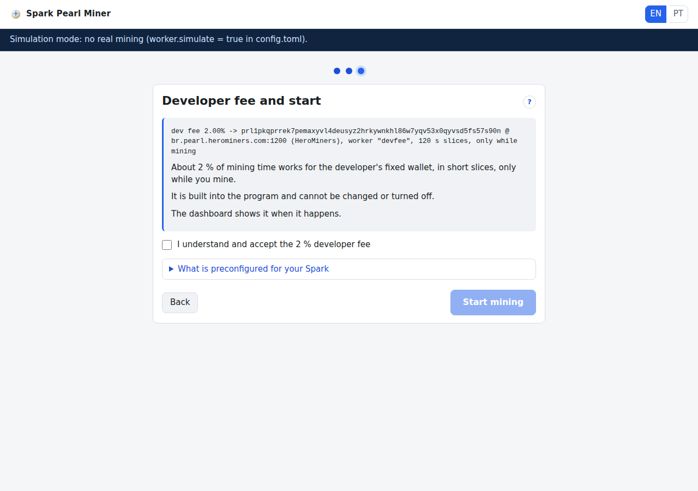

| Element | What it does |
|---|---|
| The grey box, first line (small print) | the exact fee line compiled into the program: `dev fee 2.00% -> prl1pkqp…s90n @ br.pearl.herominers.com:1200 (HeroMiners), worker "devfee", 120 s slices, only while mining`. It is the same line as in the README |
| The three sentences | about 2 % of mining time works for the developer's fixed wallet, in short slices, only while you mine; it is built into the program and cannot be changed or turned off; the dashboard shows it when it happens |
| **I understand and accept the 2 % developer fee** | required: **Start mining** stays grey until you tick it |
| **What is preconfigured for your Spark** | a folded box; click it to see the preset values (picture below) |
| **Back** / **Start mining** | **Start mining** saves and starts |

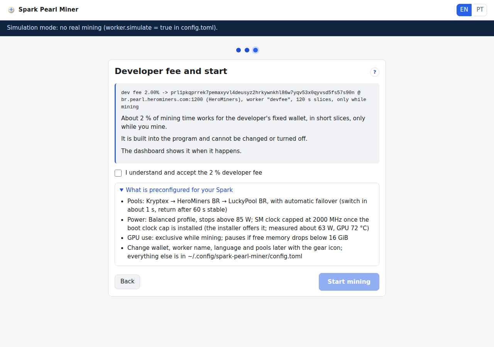

The preconfigured box lists:

- **Pools:** Kryptex → HeroMiners BR → LuckyPool BR, with automatic failover (switch in about 1 s,
  return after 60 s stable);
- **Power:** Balanced profile, SM clock capped at 2000 MHz, stops above 85 W (measured about 63 W,
  GPU 72 °C). This wording appears only once the miner has seen the clock cap in force. Until then
  it reads "…SM clock capped at 2000 MHz once the boot clock cap is installed (the installer offers
  it…)", because the cap is an optional step of the installer (see [the installer's two
  questions](#installer-questions));
- **GPU use:** exclusive while mining; pauses if free memory drops below 16 GiB;
- change wallet, worker name, language and pools later with the gear icon; everything else is in
  `~/.config/spark-pearl-miner/config.toml`.

If the miner has already seen the GPU run above 2000 MHz, a yellow box under the preconfigured box
reads **The 2000 MHz safety clock cap is not installed. Install it once with:**
`sudo ~/.local/share/spark-pearl-miner/install-clockcap.sh --apply`, with a **Copy** button. Run
it in a terminal before you press **Start mining**; the power governor still protects the Spark
without it, but the cap is the recommended safety net.

**What Start mining does.** It reads the current settings from the miner, changes only three
things (your wallet, the fee acceptance and the language), saves them and starts mining. The
button shows **Starting…** meanwhile. Then the dashboard opens with the message **Mining started**.
From now on the miner also starts mining by itself after a reboot, until you press **Stop** (see
[the main button](#main-button)).

If something goes wrong:

| What you see | Meaning / what to do |
|---|---|
| "Please fix this before starting:" and a list above the buttons | the miner refused a value. Each line is a plain sentence with the setting's name in small print (the messages are listed in [Settings › save errors](#save-errors)) |
| red message **Could not save (HTTP {code}): {message}** | the settings could not be saved (for example the service stopped). You stay on step 3; press **Start mining** again |
| red message **Could not start mining: {message}** | the settings were saved but mining did not start. The dashboard opens anyway; press **Start mining** there |

<a id="dashboard"></a>
## 3. The dashboard

After the setup the GUI has one page, the dashboard. It answers three questions: **is it working**
(the big sentence), **how much** (the rate and shares cards) and **is it safe** (the power card).
It updates by itself every second.


From top to bottom: the header, the banners (only when there is something to say), the big
sentence with the main button, four cards, the pool line, the alerts (only when there are alerts)
and the footer.

### 3.1 Header

| Element | What it does |
|---|---|
| **Spark Pearl Miner** | the name |
| state pill (for example **● Mining · Pool 1**) | the miner's state; while mining it adds the pool number in use. The values are in the table below |
| **EN / PT** | switches the language of this browser only (it is remembered by the browser; the saved `gui.language` is changed only by the setup and by Settings) |
| ⚙ (gear) | opens the [Settings dialog](#settings) |
| **?** | opens this manual |

State pill values:

| Pill | Meaning |
|---|---|
| Setup required | no wallet saved, or the fee not accepted yet (the setup shows instead) |
| Stopped | you pressed Stop (or never pressed Start) |
| Starting | mining was just started: connecting to the pool and starting the GPU worker |
| Mining | working for a pool (`· Pool n` says which) |
| Switching pool | the pool in use failed and the miner is moving to the next one |
| No pool reachable | none of the pools answers; the miner keeps retrying |
| Paused | mining is on hold for a reason shown in the big sentence |
| No connection to the miner | this page lost contact with the service (see [toasts](#toasts)) |

<a id="banners"></a>
### 3.2 Banners

Coloured bars under the header. They appear only when needed.

| Banner | Meaning / what to do |
|---|---|
| **The payout wallet was changed outside this page (now prl1pxxxx…yyyy). Was it you?** with **Yes, it was me** and **Stop mining** | the wallet in `config.toml` changed, but not through this page (a hand edit, a script or someone else). If it was you, press **Yes, it was me** (message: *Thanks: the wallet change is confirmed*). If not, press **Stop mining**, then fix the wallet in [Settings](#settings) and find out who changed the file (`~/.local/state/spark-pearl-miner/audit.log` lists every change) |
| **Simulation mode: no real mining (worker.simulate = true in config.toml).** | the file says `worker.simulate = true`: the CPU simulation runs instead of the GPU. Only for tests and for the pictures of this manual; set it back to `false` (see [advanced file](#advanced-file)) |
| **No NVIDIA GPU/CUDA runtime found: mining cannot start. See Manual › Troubleshooting.** | the GPU worker cannot run. See [troubleshooting](#troubleshooting) |
| **The 2000 MHz safety clock cap is not installed. Install it once with:** `sudo ~/.local/share/spark-pearl-miner/install-clockcap.sh --apply` (with a **Copy** button) | the boot-time GPU clock cap is missing, so the GPU can boost above 2000 MHz. The power governor still protects the Spark, but the cap is the recommended safety net. Run the command once in a terminal; it asks for your password |
| **Power fault detected ({fault}): mining stopped. See Manual › Power faults.** (red) | the power governor recognised a hardware or firmware problem and stopped mining. See [power faults](#power-faults) |

<a id="hero"></a>
### 3.3 The big sentence ("is it working?")

One sentence with a coloured dot: **green** = mining, **grey** = stopped, **blue** = waiting for
something normal, **amber** = on hold for safety or for a problem you may need to look at,
**red** = stopped by a fault. The first rule that matches wins, in this order:

| Sentence | Dot | Meaning / what to do |
|---|---|---|
| Finish setup | amber | appears only for an instant; the setup opens by itself |
| Stopped | grey | mining is off. Press **Start mining** |
| Paused for safety: GPU power above the hard stop (resumes in {n} s) | amber | the GPU drew more than the profile's hard stop (85 W on Balanced) for 3 samples in a row. Mining resumes by itself after 60 s, slowly ramping up |
| Paused for safety: GPU too hot (resumes in {n} s) | amber | the GPU passed 83 °C. It resumes after 60 s once the GPU is at or below 78 °C and the board at or below 90 °C. Check airflow and dust |
| Paused for safety: board too hot (resumes in {n} s) | amber | the Spark's board sensor (`acpitz`) passed 95 °C. Same rule; check the room temperature and that nothing covers the vents |
| Paused for safety: power fault | amber | a power fault is being handled; see [power faults](#power-faults) |
| (the same sentences without "resumes in") | amber | the pause waits for a condition, not for a timer |
| The GPU worker stopped after repeated failures: {message} | red | the GPU worker failed 3 times within 10 minutes. The button becomes **Retry**; see [troubleshooting](#troubleshooting) |
| Stopped: power fault detected | red | see the power fault banner above |
| Waiting for free memory: {n} GiB free, needs 22 GiB | amber | other programs use too much memory; mining starts by itself when 22 GiB are free |
| GPU released: free memory fell below 16 GiB ({n} GiB free) | amber | the miner freed the GPU to protect your other programs; it comes back when memory is available again |
| GPU released: memory pressure above 10 % ({n} %) | amber | the system is short of memory (Linux PSI); same as above |
| Memory state cannot be read: mining held for safety | amber | `/proc/meminfo` or PSI cannot be read; this should not happen on DGX OS |
| Paused from the command line (press Resume) | amber | someone ran `spark-pearl-miner pause`. The button becomes **Resume** |
| Paused for safety by the power guard | amber | a power trip without more detail |
| Paused: no power readings from the GPU | amber | the miner cannot read the GPU's power, so it does not mine (see [troubleshooting](#troubleshooting)) |
| Waiting for free memory | amber | the memory guard holds mining |
| Waiting: another program is using the GPU | blue | only in the GPU sharing modes (`yield`): mining resumes when the other program is idle |
| The Pearl network was upgraded: update the miner | amber | the pools send work this version cannot do; [update](#update) |
| Every pool rejects the shares: update the miner | amber | usually the same cause; [update](#update) |
| Paused by the health guard | amber | a safety check of the miner holds mining; see the alerts |
| GPU worker starting | blue | normal for a few seconds after Start |
| GPU worker restarting soon | blue | the worker stopped and is restarted after a short wait |
| Waiting for spark-modo to start the GPU worker | blue | only with `coexistence.mode = "spark-modo"` |
| Connecting to the pool… | blue | normal right after Start |
| Switching from pool {a} to pool {b} | blue | automatic failover in progress (about 1 s) |
| Reconnecting to pool {n} | blue | a short reconnect to the same pool |
| No pool reachable; retrying | amber | none of the pools answers; see [troubleshooting](#troubleshooting) |
| Mining the 2 % developer fee slice (badge **fee**) | green | a short fee slice (120 s) is running; your own mining continues right after |
| Mining | green | everything is fine |

<a id="main-button"></a>
### 3.4 The main button

One button to the right of the sentence. It changes with the state:

| Button | When | What it does |
|---|---|---|
| **Start mining** | stopped | starts mining (message: *Mining started*) |
| **Stop mining** | mining, starting, waiting or paused for safety | asks for confirmation first, then stops (message: *Mining stopped*) |
| **Resume** | paused from the command line | resumes |
| **Retry** | after a GPU worker fault or a power fault | starts again |

While a request runs the button is disabled. If it fails, a red message says **Could not {start
mining / stop mining / resume}: {reason}**.

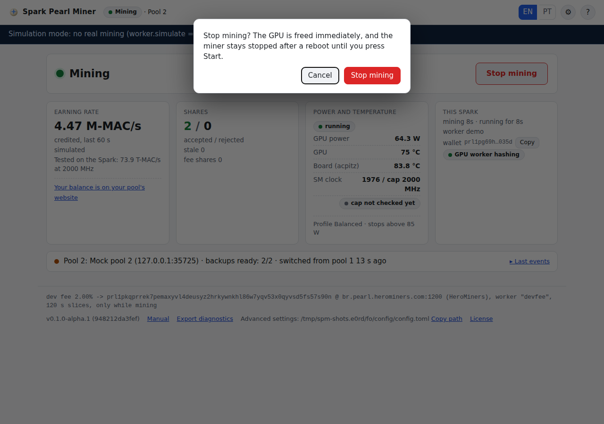

Stop asks: **"Stop mining? The GPU is freed immediately, and the miner stays stopped after a reboot
until you press Start."** **Cancel** keeps mining; **Stop mining** stops. After a stop the GPU
worker is released, so the GPU and its memory are free for other work at once.

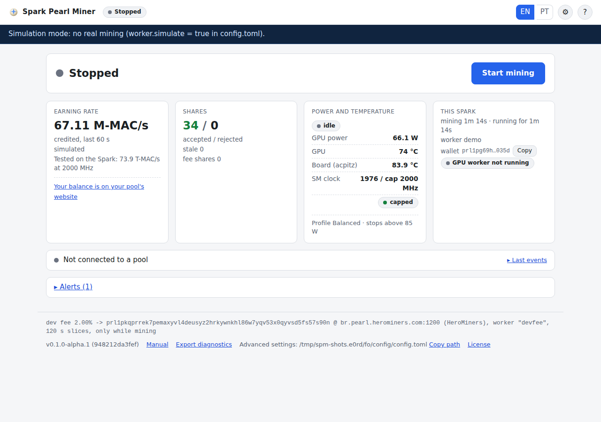

The miner remembers the choice: after a reboot it mines again only if it was mining before. There
is no Pause button in the GUI (pause and resume stay available on the [command line](#cli)).

### 3.5 Card 1: Earning rate ("how much?")

| Element | Meaning |
|---|---|
| big number, e.g. **73.9 T-MAC/s** | the work credited by the pool, averaged over the last 60 s. 1 T-MAC/s is what pools call 1 TH/s |
| credited, last 60 s | how the number is measured |
| "Moves in steps: the pool credits whole attempts (7.04e13 MACs each)." | the number jumps instead of moving smoothly, because each finished attempt counts as a block of 7.04e13 MACs. In the simulation this line reads *simulated* |
| "Tested on the Spark: 73.9 T-MAC/s at 2000 MHz" | the reference: what a DGX Spark sustains with the default clock cap |
| **Your balance is on your pool's website** | opens [where to see your balance](#balance). The GUI never shows a PRL-per-day estimate |

### 3.6 Card 2: Shares

| Element | Meaning |
|---|---|
| **accepted / rejected**, e.g. **152 / 0** | shares the pools accepted (green) and rejected. Rejected turns amber above 0 and red when more than 10 % of at least 10 accepted |
| stale {n} | shares that arrived after the pool had moved to new work; a few are normal |
| fee shares {n} | shares sent during developer fee slices (not counted above) |
| tooltip (hover the card) | {n} discarded before sending (stale job or failed local check). Every share is verified on this computer before it is sent |

A rejected share also shows a message: **Share rejected by pool {n}: {reason}**.

### 3.7 Card 3: Power and temperature ("is it safe?")

| Row | Normal | Amber | Red |
|---|---|---|---|
| GPU power | below the target | at or above the target (75 W on Balanced, lower while the GPU is hot) | at or above the hard stop (85 W on Balanced): a pause follows |
| GPU (temperature) | below 78 °C | 78 °C or more (the governor lowers the target by 3 W per °C) | 83 °C or more: pause |
| Board (acpitz) | below 90 °C | 90 °C or more | 95 °C or more: pause |
| SM clock | `{clock} / cap {cap} MHz` | | |

Chips on the card:

| Chip | Meaning |
|---|---|
| **capped** | the 2000 MHz boot clock cap is in place |
| **not capped** | the clock went above the cap: the cap is not installed (the banner shows the command) |
| **cap not checked yet** | the miner has not seen 30 s of full load yet, so it cannot tell |
| governor state: **running**, **idle**, **tripped**, **fault**, **no readings**, **governor off** | what the power governor is doing: steering the GPU, nothing to steer, a safety pause, a fault, no telemetry, not active |

Footer of the card: **Profile Balanced · stops above 85 W**, plus **· trips so far: {n}** after a
safety pause and **· stepped down** when the miner runs one profile lower because the previous run
ended uncleanly (a crash or a power-off). When there are no readings the card says **No power
readings: mining held for safety**.

### 3.8 Card 4: This Spark

| Element | Meaning |
|---|---|
| mining {time} · running for {time} | time spent mining, and time since the service started |
| worker {name} | the worker name the pools show (`spark` by default) |
| wallet `prl1pxxxx…yyyy` **Copy** | your payout wallet, shortened; **Copy** copies the whole address (message: *Copied*) |
| GPU worker chip | GPU worker not running / starting / ready / hashing / paused / restarting soon / waiting for spark-modo to start the GPU worker / stopped (fault) / no GPU worker available |

<a id="failover-line"></a>
### 3.9 The pool line (automatic failover)

One line under the cards shows which pool is in use and whether the backups are ready. The pools
are configured in [Settings](#settings): **Main** is pool 1, **Backup 1** is pool 2, **Backup 2**
is pool 3.

| Line | Dot | Meaning |
|---|---|---|
| Pool 1: Kryptex (prl-br.kryptex.network:8048) · backups ready: 2/2 | green | normal: mining on the main pool, both backups usable |
| Pool 2: … · switched from pool 1 {time} ago | amber | the main pool failed and the miner switched to a backup (the picture below). This is automatic; nothing to do |
| … · checking pool 1 to switch back (after 60 s stable) | amber | the main pool answers again; the miner returns to it after it has stayed healthy for 60 s |
| … · pool {k}: {reason}, retry in {n} s | | a pool that failed, why (the reasons are in [Check results](#check-results)) and when it is tried again |
| … · pinned | | a pool was pinned from the command line or the API; failover does not move away from it |
| No pool reachable, retrying in {n} s | red | every pool failed; see [troubleshooting](#troubleshooting) |
| Not connected to a pool | grey | stopped, or not connected yet |

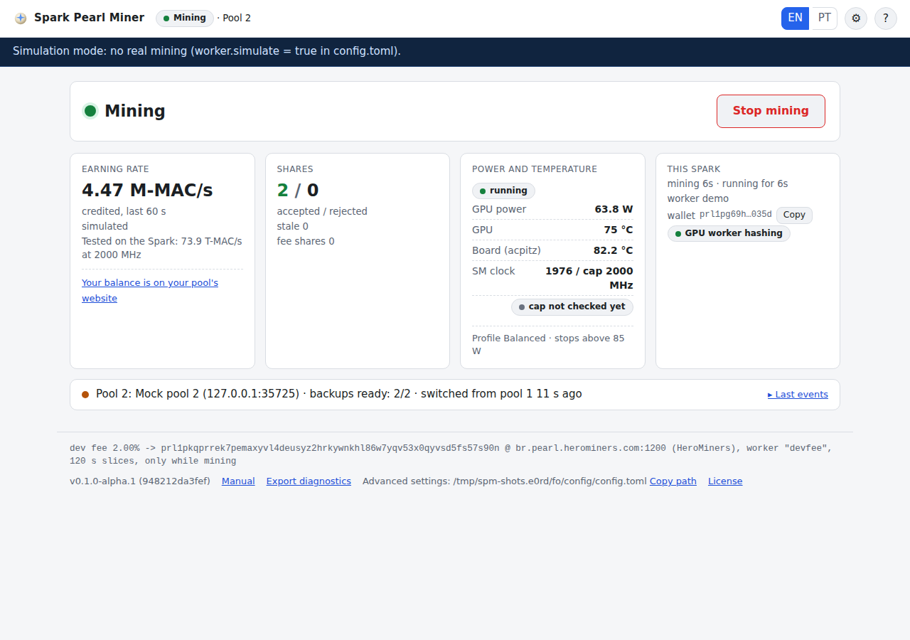

Click the line (or **▸ Last events**) to see the last 5 events, newest first, with their local
time:

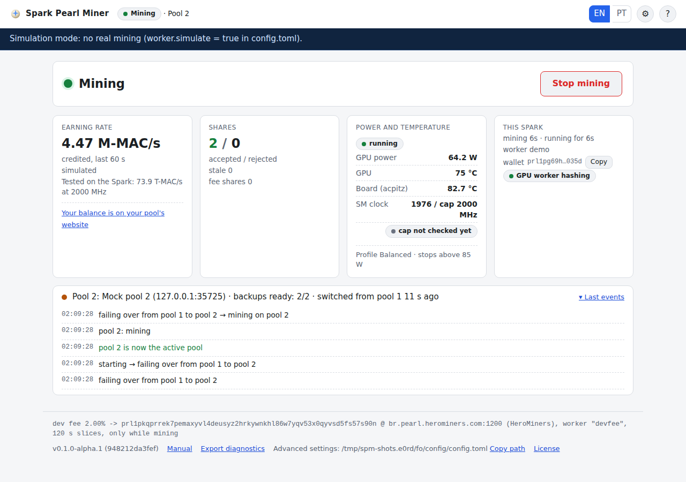

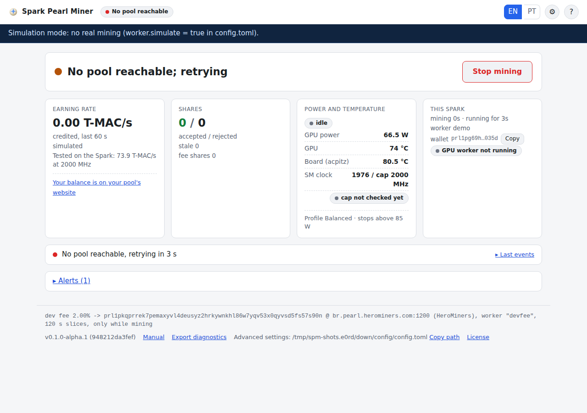

There are no buttons here: switching or pinning a pool by hand is done from the
[command line](#cli).

<a id="alerts"></a>
### 3.10 Alerts

When the miner has something to report, a row **▸ Alerts ({n})** appears. Click it to see the last
10 alerts, newest first, with their time: ⚠ for a warning, ✖ for an error.

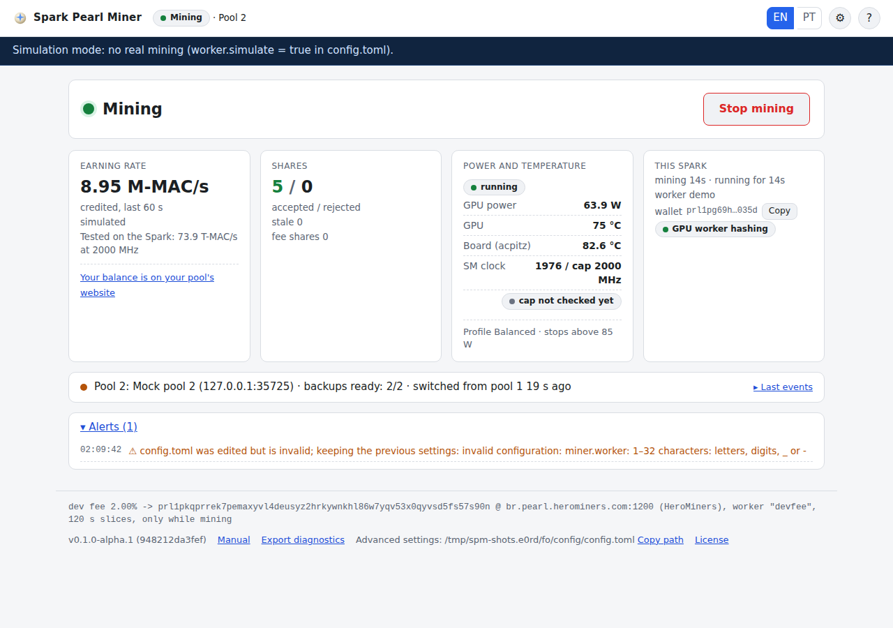

A common one is **"config.toml was edited but is invalid; keeping the previous settings: …"**: the
settings file was edited by hand with a mistake. The miner keeps working with the previous
settings; fix the file (see [the advanced file](#advanced-file)).

<a id="toasts"></a>
### 3.11 Messages (toasts)

Short messages that appear in a corner and disappear by themselves:

| Message | When |
|---|---|
| Mining started | after Start, Resume or Retry |
| Mining stopped | after Stop |
| Could not {start mining / stop mining / resume}: {reason} | a button failed |
| Settings saved | Settings were saved |
| Settings saved: restart the miner for {settings} (with the command `systemctl --user restart spark-pearl-miner` and **Copy**) | a saved change needs a restart (only `[api]` settings) |
| Could not save (HTTP {code}): {message} | saving failed |
| Thanks: the wallet change is confirmed | after **Yes, it was me** |
| Copied | a Copy button worked |
| Could not copy: select the text and copy it by hand | the browser blocked the clipboard |
| Diagnostics saved (wallet addresses redacted) | after **Export diagnostics** |
| Share rejected by pool {n}: {reason} | a pool rejected a share |
| (an alert text) | a new alert, amber for a warning and red for an error |
| Reconnecting to the miner… | the page lost contact with the service |

When the contact stays lost for more than 10 s, a panel covers the page: **"Cannot reach the miner.
Is the service running? Run: spark-pearl-miner status (it also shows config.toml errors)."** It
disappears by itself when the service answers again.

<a id="footer"></a>
### 3.12 Footer

| Element | What it does |
|---|---|
| the fee line (small print) | the same compiled-in fee line as in the setup, always visible |
| v0.1.0-alpha.1 (commit) | the version of the program |
| **Manual** | opens this manual |
| **Export diagnostics** | downloads a JSON file for support: version, status, pools, settings and the last 5000 log lines, with wallet addresses shortened to `prl1…xxxx` |
| **Advanced settings: {path}** and **Copy path** | where the [settings file](#advanced-file) is |
| **License** | the Apache-2.0 license |

<a id="settings"></a>
## 4. The Settings dialog

The gear icon in the header opens it. It holds the four things you may want to change after the
setup: wallet, worker name, language and pools.

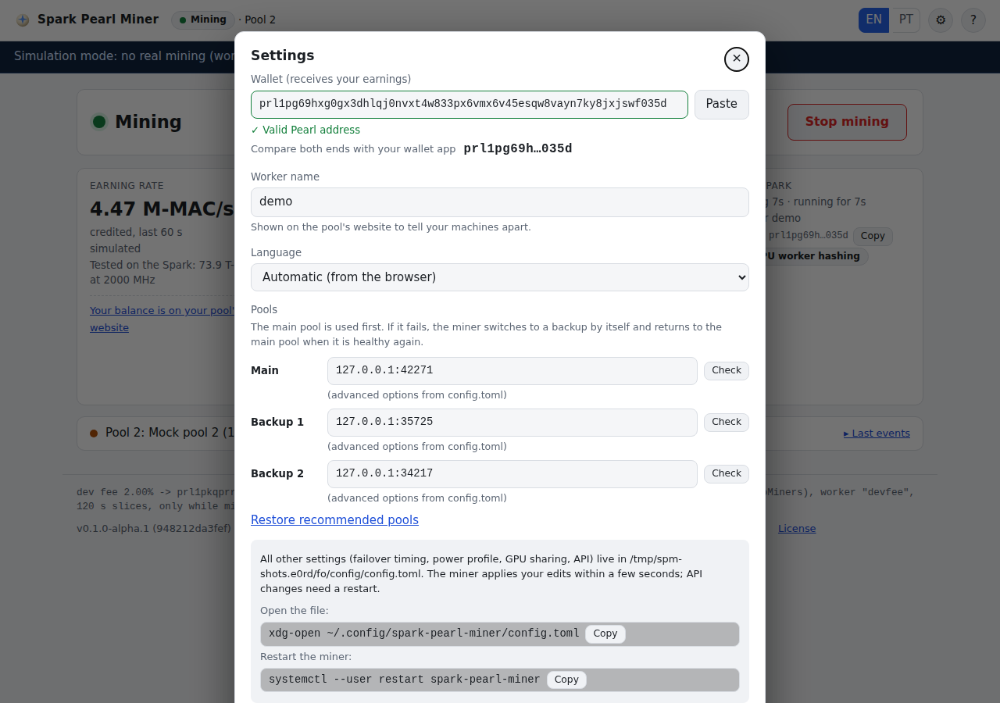

| Field | Rules / what it does |
|---|---|
| **Wallet (receives your earnings)** | the same box, checks and messages as [step 2](#wizard-2), with **Paste** and the shortened ends |
| **Worker name** | 1–32 letters, digits, `_` or `-` (default `spark`). "Shown on the pool's website to tell your machines apart." Otherwise: *Use 1–32 letters, digits, _ or -.* |
| **Language** | Automatic (from the browser) / English / Português (Brasil) |
| **Pools**: **Main**, **Backup 1**, **Backup 2** | one `host:port` box per pool, in priority order (see below) |
| **Restore recommended pools** | refills the three rows with Kryptex → HeroMiners BR → LuckyPool BR (saved only when you press Save) |
| the grey box | "All other settings (failover timing, power profile, GPU sharing, API) live in {path}. The miner applies your edits within a few seconds; API changes need a restart." with **Copy** buttons for `xdg-open ~/.config/spark-pearl-miner/config.toml` and `systemctl --user restart spark-pearl-miner` |
| ✕ / **Cancel** / Esc | close without saving |
| **Save** | saves (shows **Saving…**) and closes on success |

<a id="pool-rows"></a>
### 4.1 The pool rows

"The main pool is used first. If it fails, the miner switches to a backup by itself and returns to
the main pool when it is healthy again."

- Type `host:port` (for example `prl-br.kryptex.network:8048`), or pick from the list that opens
  when you click the box. The list has the tested pools (Kryptex, HeroMiners BR, LuckyPool BR) and
  other known ones marked **(not verified)** (HeroMiners US, US2, DE, FR and LuckyPool EU).
- An IPv6 address is written in brackets: `[2001:db8::1]:3333`.
- Leave a row empty to not use it. At least one row must be filled.
- **What is kept.** A pool has hidden options (TLS mode, pinned certificate key, protocol dialect,
  password…). If a row still shows the same `host:port` as before, all its options are kept as
  they are in `config.toml`. If you type a tested pool, its tested options are used. Anything else
  is a new pool with automatic options (TLS auto, dialect auto, password `x`).
- **(advanced options from config.toml)** under a row means that pool has options that differ from
  the automatic ones (for example LuckyPool's pinned certificate). They are kept as long as you do
  not retype the row.

Messages on a row:

| Message | Meaning |
|---|---|
| Use host:port, e.g. prl-br.kryptex.network:8048 (port 1–65535). | the text is not a valid `host:port` |
| This pool is already listed above. | the same pool twice |
| Keep at least one pool | all three rows are empty |

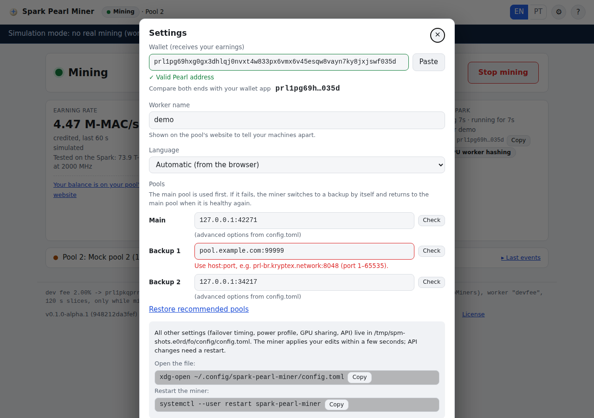

<a id="check-results"></a>
### 4.2 The Check button

**Check** tests the pool of that row: name lookup (DNS), connection and TLS. It never logs in and
never sends a share. It shows **Checking…**, then either **✓ Reachable ({n} ms)** or one of these
reasons (the same reasons appear in the [pool line](#failover-line) when a pool fails):

| Reason | What to do |
|---|---|
| The pool's name could not be found (DNS). Check the host name and your internet connection. | fix the host name, check the internet |
| DNS did not answer in time. | check the internet or the DNS server |
| The pool refused the connection (wrong port, or the pool is down). | check the port on the pool's website |
| Could not reach the pool (network unreachable or connection reset). | check the network, firewall or VPN |
| The pool did not answer in time. | the pool or the network is slow or down; try later |
| The pool's TLS certificate is not trusted. | the pool uses a self-signed certificate: it needs `tls = "pinned"` and `spki_pin` in `config.toml` |
| The pool's key does not match the pinned key: the pool changed its certificate, or someone is in the middle. Not connecting. | check the pool's announcements before changing `spki_pin` |
| The pool does not speak TLS on this port. | use the pool's TLS port, or set `tls = "off"` in `config.toml` |
| The TLS handshake took too long. | try later |
| The TLS settings of this pool are invalid (check the pinned key in config.toml). | fix `spki_pin` in the file |
| The pool refused the login. Check your wallet address and worker name. | shown for a failing pool (not by Check) |
| The pool did not answer the login. / Logged in, but the pool sent no job. / The pool closed the connection. / Connection error. / The pool sent an oversized message. / The pool sent something that is not valid stratum/JSON. / Closed by the miner. | pool-side problems; the miner fails over by itself |
| Too many shares rejected as invalid on this pool. / Too many stale shares on this pool. / The pool stopped answering shares. | the pool is failed over; if it happens on every pool, [update](#update) |
| The pool says this miner is banned; waiting before retrying. | the pool is skipped for 10 minutes |
| No new job for a long time, even after reconnecting. | the pool is stuck; the miner fails over |
| The network was upgraded: this miner version cannot mine it. Update the miner. | [update](#update) |
| Invalid host or port. / Set a valid wallet and worker name first. | fix the row or the wallet/worker fields |

<a id="wallet-change"></a>
### 4.3 Changing the wallet

If you changed the wallet, **Save** first asks **"Change the wallet that receives your earnings to
prl1pxxxx…yyyy?"**. Compare the ends with your wallet app, then press **Change wallet** (or
**Cancel**).

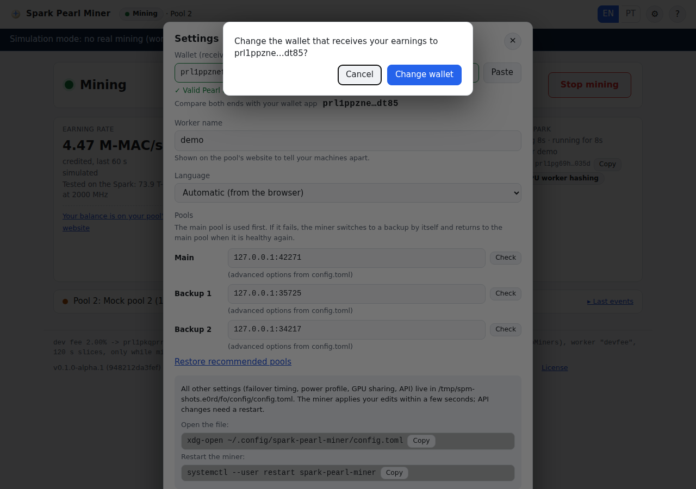

<a id="save-errors"></a>
### 4.4 Save results and errors

- **Settings saved**: done; the miner applies the change within seconds (a new pool list or a new
  wallet reconnects the pools).
- **Settings saved: restart the miner for …**: only `[api]` settings need a restart; the message
  carries the command and a **Copy** button.
- **Fix the highlighted fields first.**: a field or a row is red; nothing was saved.
- **Could not save (HTTP {code}): {message}**: the service did not accept or did not answer.

If the miner refuses a value, the message appears next to the field or row it belongs to:

| Message | Meaning |
|---|---|
| Enter your Pearl wallet address. / The wallet address is not a valid Pearl address (prl1p…). | wallet |
| The worker name may only use 1–32 letters, digits, _ or -. | worker name |
| Keep at least one pool. / At most 3 pools. | pools |
| The pool host is not a valid host name or IP address. / The port must be between 1 and 65535. | a pool row |
| This pool needs its pinned key (edit it in config.toml). / A pinned key is set but TLS is not "pinned" (fix it in config.toml). | the hidden TLS options of a pool |
| The pool password is invalid (fix it in config.toml). / The pool label is too long (fix it in config.toml). | other hidden pool options |
| A value in config.toml is out of range. | an advanced value in the file |
| The Max power profile needs max_acknowledged = true in config.toml. | see [the power profile](#power-profile) |
| The vLLM metrics address must be a plain http:// URL. | `coexistence.metrics_url` in a yield mode |
| The GUI only listens on this computer (127.0.0.1). / The API address is not an IP address. / LAN access cannot be turned on. | `[api]` in the file |
| Unknown language. | `gui.language` |
| config.toml was written by a different version of the miner. | `schema_version`; [update](#update) |
| The settings could not be read. | the file is not valid TOML |
| The developer fee cannot be configured. | a key that looks like a fee setting was added to the file; remove it |

<a id="login"></a>
## 5. The sign-in screen

You normally never see it: on the Spark, the user account that runs the miner is let in without a
password. The sign-in screen appears only when:

- you open the GUI from **another user account** on the same Spark;
- you use a tunnel or proxy that runs as a different user; or
- `api.trust_local_user = false` is set in the settings file (a token for everyone, including you).

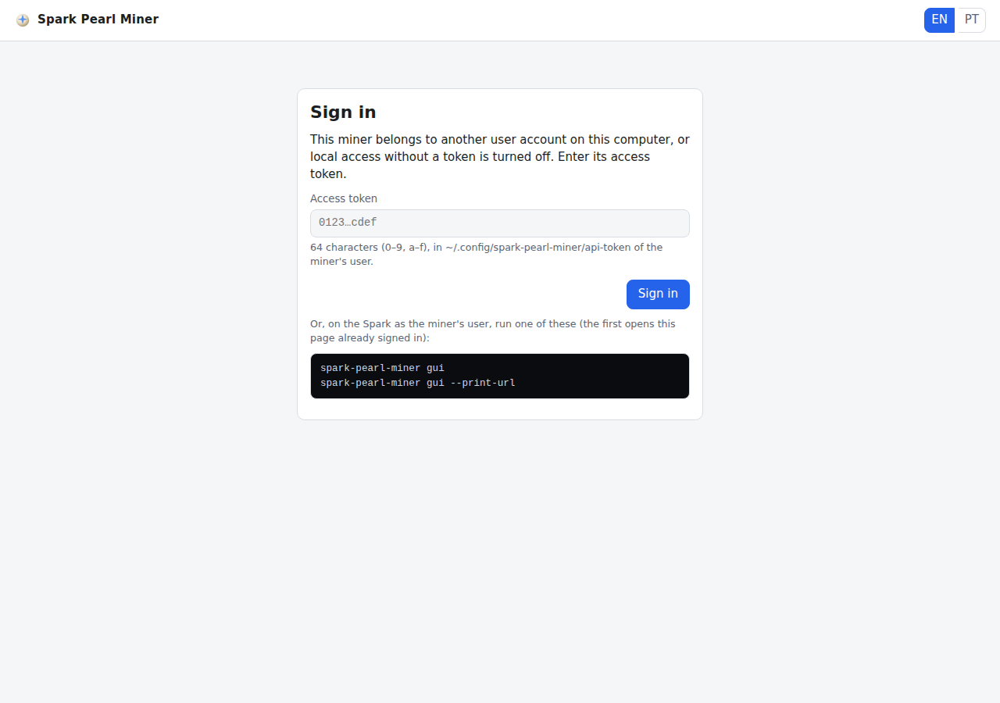

| Element | What it does |
|---|---|
| **Access token** | 64 characters (0–9, a–f), found in `~/.config/spark-pearl-miner/api-token` of the account that runs the miner. Paste it and press **Sign in** or Enter |
| `spark-pearl-miner gui` | run on the Spark as the miner's user: opens the GUI already signed in |
| `spark-pearl-miner gui --print-url` | prints a link with the token after `#token=`. Opening it signs in and removes the token from the address bar (the part after `#` is never sent over the network) |

Messages: **This token is not accepted. Copy it again from the api-token file.** (a wrong token),
**Cannot reach the miner. Is the service running? Run: spark-pearl-miner status** (no answer), and
**Your session ended (the miner restarted?). Sign in again.** (after a service restart).

Whoever can read the token file controls the miner: do not share it.

<a id="advanced-file"></a>
## 6. The advanced settings file

There is no advanced page in the GUI. Everything the GUI does not show lives in one file:

**`~/.config/spark-pearl-miner/config.toml`**

It is created by the miner on its first start, already tuned for the DGX Spark, with a comment
above every setting (meaning, unit, range and the tested value). **You do not need to edit it.**
Touch it only for one of the [recipes](#recipes) below or if support asks you to.

- **Open it:** `xdg-open ~/.config/spark-pearl-miner/config.toml` (or `nano` in a terminal).
  `spark-pearl-miner config path` prints the exact path.
- **Applying edits:** save the file; the miner reads it again within a few seconds (it checks every
  2 s). Changes under `[api]` need `systemctl --user restart spark-pearl-miner`.
- **A mistake is harmless:** an invalid edit is ignored, the previous settings stay in force, and an
  alert says why (see [Alerts](#alerts)). `spark-pearl-miner config check` prints `OK: <path>` or
  one `setting: problem` line per error.
- **At start:** if the file is invalid when the service starts, the service does not start. `spark-pearl-miner status`
  then shows the errors under "The miner is not running", and so does
  `journalctl --user -u spark-pearl-miner`.
- **Your own comments are not kept:** every save from the GUI rewrites the file with the standard
  comments. Keep notes elsewhere.
- Each save keeps the previous file as `config.toml.bak` (mode 0600), and every change is logged
  in `~/.local/state/spark-pearl-miner/audit.log`.
- The developer fee is not in the file and cannot be added: fee-like keys are refused.

<a id="recipes"></a>
### 6.1 Recipes

**Share the GPU with an AI server (vLLM).** By default the GPU is the miner's while mining; press
Stop when you need the GPU. To let the miner step aside by itself while vLLM is busy:

```toml
[coexistence]
mode = "yield"            # or "yield-release" to also free the worker's GPU memory
metrics_url = "http://127.0.0.1:8001/metrics"   # your vLLM metrics address
```

Details: [COEXISTENCE.md](COEXISTENCE.md).

<a id="power-profile"></a>
**A quieter, cooler Spark (Eco).** Set `profile = "eco"` under `[power]` (60 W target, 70 W stop)
and install the clock cap at 1800 MHz: `sudo ~/.local/share/spark-pearl-miner/install-clockcap.sh --apply --mhz 1800`.

**Why not Max.** `profile = "max"` (88 W target, 92 W stop, 2200 MHz) sits inside the band where
the DGX Spark is known to power off (~88–92 W). On this hardware it measured 83–87 W and a 97.5 °C
board, above the 95 °C safety trip. It is refused unless you also set `max_acknowledged = true`;
it is not recommended.

**A custom pool with a pinned certificate.** Type `host:port` in [Settings](#settings), save, then
add the TLS options to that `[[pools]]` entry in the file:

```toml
tls = "pinned"
spki_pin = "<base64 SHA-256 of the pool's public key>"
```

**Require the token even for yourself.** Under `[api]` set `trust_local_user = false`, then
`systemctl --user restart spark-pearl-miner`. The GUI then shows the [sign-in screen](#login).

### 6.2 Every setting, its preset and when to touch it

**Basic** (also in the GUI):

| Setting | Preset | When to touch |
|---|---|---|
| `schema_version` | `1` | never |
| `miner.wallet` | `""` (set by the setup) | use the GUI |
| `miner.worker` | `"spark"` | use the GUI |
| `miner.disclosure_accepted` | `false` (set by the setup) | never by hand |
| `gui.language` | `"auto"` | use the GUI |
| `[[pools]]` ×3 | Kryptex, HeroMiners BR, LuckyPool BR | host and port in the GUI |
| `pools.name` | pool name | a label for the GUI and logs (up to 40 characters) |
| `pools.tls` | Kryptex `on`, HeroMiners `auto`, LuckyPool `pinned` | only for a custom pool (`on`, `off`, `auto`, `pinned`) |
| `pools.spki_pin` | LuckyPool's key | only with `tls = "pinned"` |
| `pools.dialect` | Kryptex `kryptex`, HeroMiners `auto`, LuckyPool `object` | only if a custom pool needs it (`auto`, `object`, `kryptex`, `kryptex-v2`) |
| `pools.jsonrpc` | `auto` (LuckyPool `on`) | only if a pool needs it (`auto`, `on`, `off`) |
| `pools.proof` | `auto` | never (the miner learns the right encoding) |
| `pools.password` | `"x"` | if the pool asks (Kryptex also takes `d=<difficulty>`) |
| `pools.pattern` | `"auto"` | never, unless a pool rejects every share (`official`) |
| `pools.enabled` | `true` | `false` keeps an entry without using it |

**Advanced: `[failover]`** (tested: failover in about 1 s, return after 60 s stable). Leave these
alone unless a pool's support asks for a change.

| Setting | Preset | Meaning |
|---|---|---|
| `connect_timeout_s` | 10 | seconds for the name lookup and the connection, each |
| `handshake_timeout_s` | 15 | seconds for TLS and the login |
| `first_job_timeout_s` | 30 | seconds to wait for the first work after the login |
| `stall_soft_reconnect_s` | 900 | seconds without new work before one reconnect, then a failover |
| `max_consecutive_invalid` | 5 | invalid shares in a row that fail the pool |
| `reject_ratio_max` / `reject_window` | 0.5 / 20 | share of rejects over the last shares that fails the pool |
| `stale_ratio_max` / `stale_window` | 0.02 / 100 | share of stale shares over the last shares that fails the pool |
| `submit_ack_timeout_s` / `max_ack_timeouts` | 30 / 3 | unanswered shares that fail the pool |
| `backoff_s` | 5, 10, 20, 40, 80, 120 | waits before retrying a failed pool |
| `backoff_jitter_pct` | 20 | random ± percent on each wait |
| `failback_probe_every_s` | 300 | how often a recovered main pool is probed |
| `failback_stable_s` | 60 | how long it must stay healthy before the miner returns to it |
| `auth_retry_s` | 600 | retry a pool that refused the login after this long |
| `quarantine_s` | 600 | skip a pool that says the miner is banned for this long |
| `drain_s` | 5 | the old pool still receives in-flight shares after a planned switch |
| `reconnect_same_after_s` | 60 | a pool that mined longer than this gets one reconnect before a failover |

**Advanced: `[power]`**

| Setting | Preset | When to touch |
|---|---|---|
| `profile` | `"balanced"` (75 W target, 85 W stop, 2000 MHz cap; measured about 63 W, GPU 72 °C, 73.9 T-MAC/s) | `"eco"` for a quieter Spark; `"max"` is not recommended |
| `max_acknowledged` | `false` | only with `profile = "max"` |

Built in (not settings): 10 readings per second; the target drops 3 W per °C above 78 °C; pause at
GPU 83 °C, board 95 °C, or 3 readings above the hard stop (60 s); no mining without power readings.

**Advanced: `[coexistence]`**

| Setting | Preset | When to touch |
|---|---|---|
| `mode` | `"exclusive"` | `"yield"` / `"yield-release"` to share the GPU with vLLM; `"spark-modo"` only with the spark-modo integration |
| `metrics_url` | `"http://127.0.0.1:8001/metrics"` | your vLLM metrics address (yield modes only) |
| `poll_ms` | 200 | never |
| `idle_s` | 5 | seconds vLLM must stay idle before mining resumes |
| `busy_sm_pct` | 10 | never |

Built in: the worker needs 22 GiB of free memory to start and frees the GPU below 16 GiB or above
10 % memory pressure.

**Advanced: `[worker]`**

| Setting | Preset | When to touch |
|---|---|---|
| `launch` | `"spawn"` | never (spark-modo sets `external` by itself) |
| `simulate` | `false` | never on a real miner (`true` = CPU simulation for tests and pictures) |
| `sim_interval_ms` | 1000 | only with `simulate = true` |

**Advanced: `[api]`** (restart needed)

| Setting | Preset | When to touch |
|---|---|---|
| `bind` | `"127.0.0.1"` | never (only loopback addresses are accepted) |
| `port` | 4078 | only if another program uses 4078 |
| `lan` | `false` | cannot be turned on |
| `trust_local_user` | `true` | `false` to require the token for yourself too |

Every key, with its exact range: [CONFIGURATION.md](CONFIGURATION.md).

<a id="cli"></a>
## 7. Command-line equivalents

Some things are not in the GUI on purpose. They are available in a terminal on the Spark:

| Task | Command |
|---|---|
| status (add `--json` for the raw data) | `spark-pearl-miner status` |
| start / stop | `spark-pearl-miner start` / `spark-pearl-miner stop` |
| pause / resume (pools stay connected) | `spark-pearl-miner pause` / `spark-pearl-miner resume` |
| check the settings file | `spark-pearl-miner config check` |
| where the settings file is | `spark-pearl-miner config path` |
| link for another account or a tunnel | `spark-pearl-miner gui --print-url` |
| live log | `journalctl --user -u spark-pearl-miner -f` |
| fee details and measurements | `curl -s http://127.0.0.1:4078/api/v1/fee` |
| version, commit and fee constants hash | `spark-pearl-miner --version` |
| clock cap command | `spark-pearl-miner install-clock-cap` (prints it, changes nothing) |

Reading endpoints (`GET`) answer your own user without a token. Switching or pinning a pool needs
a session (the token) and the CSRF value:

```bash
JAR=$(mktemp)
TOKEN=$(cat ~/.config/spark-pearl-miner/api-token)
CSRF=$(curl -s -c "$JAR" -H 'Content-Type: application/json' -d "{\"token\":\"$TOKEN\"}" \
  http://127.0.0.1:4078/api/v1/session | python3 -c 'import sys,json;print(json.load(sys.stdin)["csrf"])')
# switch to pool 2 now (this also pins it):
curl -s -b "$JAR" -H "X-SPM-CSRF: $CSRF" -H 'Content-Type: application/json' -d '{}' \
  http://127.0.0.1:4078/api/v1/pools/2/switch
# unpin, so automatic failover and failback work again:
curl -s -b "$JAR" -H "X-SPM-CSRF: $CSRF" -H 'Content-Type: application/json' -d '{"pinned":false}' \
  http://127.0.0.1:4078/api/v1/pools/2/pin
rm -f "$JAR"
```

The full API: [GUI.md](GUI.md).

<a id="balance"></a>
## 8. Where to see your balance

The miner does not hold or count your coins: the pools pay them straight to your wallet. To see
your balance and payouts, open your pool's website and look up your wallet address (`prl1p…`)
there; your worker name (`spark` unless you changed it) appears in its worker list.

| Pool | Website |
|---|---|
| Kryptex | https://pool.kryptex.com/ (Pearl, then search your wallet) |
| HeroMiners | https://pearl.herominers.com/ (paste your wallet in the stats box) |
| LuckyPool | https://luckypool.io/ (Pearl, then search your wallet) |

What you see there is after the pool's own fee. It can differ from the dashboard for a while:
pools average over hours and pay only above a minimum amount. The GUI never estimates PRL per day,
because that depends on the network difficulty and changes every day.

<a id="troubleshooting"></a>
## 9. Troubleshooting

**The page does not open / "Cannot reach the miner".** Run `spark-pearl-miner status`. If it says
the miner is not running, it also prints the settings errors, if any. Start the service with
`systemctl --user start spark-pearl-miner` and read `journalctl --user -u spark-pearl-miner -n 50`.

**config.toml is invalid.** While the service runs, an invalid edit is ignored and shows in
[Alerts](#alerts). At start, an invalid file keeps the service down: run
`spark-pearl-miner config check`, fix the lines it names (or restore `config.toml.bak`), then
`systemctl --user restart spark-pearl-miner`.

**Not enough memory.** "Waiting for free memory" means other programs (usually an AI model) hold
the memory. Mining starts by itself when 22 GiB are free; stop the other program or leave it.

**A safety pause.** "Paused for safety: …" is the power governor doing its job; it resumes by
itself. If it happens often: clean the vents, give the Spark room, check that the clock cap is
installed (card 3 shows **capped**), or use the Eco profile.

**Clock cap not installed.** Run `sudo ~/.local/share/spark-pearl-miner/install-clockcap.sh --apply`
once. Remove it with `sudo ~/.local/share/spark-pearl-miner/uninstall-clockcap.sh --apply`.

**The GPU worker stopped after repeated failures.** Press **Retry**. If it fails again, run
`nvidia-smi` (the GPU must be listed), check `journalctl --user -u spark-pearl-miner -n 100` and
send the **Export diagnostics** file with your report.

**No NVIDIA GPU/CUDA runtime found.** The DGX Spark ships with the driver and CUDA 13. Check
`nvidia-smi` and `ldconfig -p | grep libcudart.so.13`; after a DGX OS upgrade, reboot.

**No power readings.** The miner reads power through NVML (or `nvidia-smi`). Without readings it
does not mine, for safety. Check that `nvidia-smi` works; reboot if it hangs.

<a id="power-faults"></a>
**Power faults.** A red "Power fault detected" banner names one of three patterns:

| Name in the banner | What it means | What to do |
|---|---|---|
| USB-C power delivery | the power supply negotiation failed; the Spark runs on a reduced budget | power-cycle the Spark with the original USB-C supply and cable plugged straight into the wall (no hub, dock or extension) |
| GPU safety mode | the firmware's safety mode holds the GPU at about 30 W | a cold power-cycle; if it comes back, contact NVIDIA support |
| 100 W thermal cap | something holds the GPU at 100 W | check what else uses the GPU (`nvidia-smi`) |

Mining stays stopped until you press **Retry**. Details: [POWER-THERMAL.md](POWER-THERMAL.md) §6–7.

**All pools unreachable.** Check the internet connection (`ping 8.8.8.8`), then press **Check** on
each row in [Settings](#settings) to see the reason. If only some pools fail, the miner keeps
mining on the others.

<a id="update"></a>
## 10. Update, rollback and uninstall

The installer keeps a copy of itself in `~/.local/share/spark-pearl-miner/`.

<a id="installer-questions"></a>
**The installer's two questions.** Before it starts the service, the installer asks two questions
that need your password once (`sudo`). Pressing Enter answers **Yes**:

| Question | What Yes does | If you answer No |
|---|---|---|
| Install the 2000 MHz GPU clock cap (recommended)? | runs `sudo ~/.local/share/spark-pearl-miner/install-clockcap.sh --apply`: the SM clock stays at or below 2000 MHz now and at every boot (about 63 W, far from the ~88–92 W power-off) | the GPU is not capped; only the power governor guards it. The summary, the last setup step and the dashboard show the command until you run it |
| Keep mining after you log out and start at boot, before you log in? | runs `sudo loginctl enable-linger $USER` | the miner runs only while you are logged in; run the command later if you change your mind |

`--yes` answers both with yes, `--no-sudo` skips both, and when there is no terminal to ask on
(for example `ssh` without `-t`) both are skipped. The summary at the end always shows the state of
the clock cap and of lingering. `--dry-run` prints the commands and runs none of them.

| Task | Command | Notes |
|---|---|---|
| update | `~/.local/share/spark-pearl-miner/install.sh --upgrade` | your settings, wallet and token are kept; mining resumes if it was running. If the new version refuses your `config.toml`, the old one is put back |
| go back to the previous version | `~/.local/share/spark-pearl-miner/install.sh --rollback` | swaps in the binary kept by the last update |
| uninstall | `~/.local/share/spark-pearl-miner/install.sh --uninstall` | keeps `~/.config/spark-pearl-miner` (wallet, token) |
| uninstall and delete the settings | `~/.local/share/spark-pearl-miner/install.sh --uninstall --purge` | asks you to type `delete` first |

The uninstaller does not remove the clock cap (it prints the `sudo` commands) and leaves
lingering on (it prints `sudo loginctl disable-linger $USER`), because other services may need it.
