# Spark Pearl Miner: manual do usuário

_English: [../en/MANUAL.md](../en/MANUAL.md)_

Este manual cobre tudo o que aparece na interface web do minerador (a GUI): os três passos da
configuração, o painel, o diálogo de Configurações, a tela de login, todas as mensagens que a GUI
pode mostrar e o único arquivo de configurações para o que a GUI não mostra. Cada tela tem uma
imagem.

**Sumário**

0. [Sobre as imagens](#about-the-pictures)
1. [Abrindo o minerador](#opening)
2. [Primeira execução: os três passos](#first-run)
3. [O painel](#dashboard)
4. [O diálogo de Configurações](#settings)
5. [A tela de login](#login)
6. [O arquivo de configurações avançadas](#advanced-file)
7. [Equivalentes na linha de comando](#cli)
8. [Onde ver o seu saldo](#balance)
9. [Solução de problemas](#troubleshooting)
10. [Atualizar, voltar versão e desinstalar](#update)

<a id="about-the-pictures"></a>
## 0. Sobre as imagens

Todas as imagens deste manual foram tiradas de um minerador **simulado** (`worker.simulate = true`)
com pools falsas no mesmo computador, então nenhuma mostra mineração de verdade. Por isso:

- uma faixa azul-escura no topo diz **"Modo simulação: nada é minerado de verdade (worker.simulate =
  true no config.toml)."** Num minerador de verdade essa faixa nunca aparece;
- a taxa de ganho é minúscula (M-MAC/s em vez de cerca de 74 T-MAC/s) e o cartão diz *simulado*;
- as pools se chamam "Mock pool 1/2" em `127.0.0.1`, e o caminho das configurações no rodapé é uma
  pasta temporária em vez de `~/.config/spark-pearl-miner/config.toml`;
- a carteira mostrada (`prl1pg69h…035d`) é um endereço válido de exemplo que não pertence a ninguém.

As imagens são geradas de novo com `tools/screenshots.sh` (veja o cabeçalho do script). As imagens
em inglês ficam em `docs/images/en/`, as em português em `docs/images/pt-BR/`.

<a id="opening"></a>
## 1. Abrindo o minerador

O minerador é um serviço em segundo plano (`spark-pearl-miner`, um serviço systemd do usuário) que
fica sempre rodando. A GUI é uma página web que ele serve só neste computador, em
**http://127.0.0.1:4078/**.

| Como | O que acontece |
|---|---|
| Menu de aplicativos → **Spark Pearl Miner** | abre a GUI no navegador |
| `spark-pearl-miner gui` num terminal | o mesmo; também inicia o serviço se ele não estiver rodando |
| digitar `http://127.0.0.1:4078/` no navegador | o mesmo, quando você está logado no Spark com o usuário que instalou o minerador |
| `spark-pearl-miner gui --print-url` | imprime um link que leva o token de acesso (para outra conta ou acesso remoto) |

**De outro computador.** A GUI nunca escuta na rede. Encaminhe a porta por SSH e abra a página no
seu computador:

```bash
ssh -L 4078:127.0.0.1:4078 voce@seu-spark
# depois abra http://127.0.0.1:4078/ neste computador
```

Mantenha 4078 nas duas pontas. Como o túnel roda com o seu usuário no Spark, a GUI abre sem token;
se pedir um, veja [a tela de login](#login).

<a id="first-run"></a>
## 2. Primeira execução: os três passos

Enquanto nenhuma carteira estiver salva, ou a taxa do desenvolvedor não tiver sido aceita, a GUI
mostra a configuração em vez do painel. São três passos, indicados por três pontos no topo (o ponto
atual fica destacado, os concluídos ficam preenchidos). O cabeçalho mostra só o nome e o seletor
**EN / PT**.

Nada é salvo antes do último botão, **Começar a minerar**. Você pode **Voltar** a qualquer momento;
o que digitou é mantido, mesmo trocando o idioma. Cada passo tem um pequeno botão **?** no canto que
abre a parte correspondente deste manual.

Tudo o que não é perguntado aqui (pools, tempos do failover, limites de energia, compartilhamento da
GPU, a API local, o nome do worker) já vem ajustado para o DGX Spark. Você pode trocar a carteira, o
nome do worker, o idioma e as pools depois pelo ícone de engrenagem ([Configurações](#settings)).

<a id="wizard-1"></a>
### Passo 1: Boas-vindas / idioma

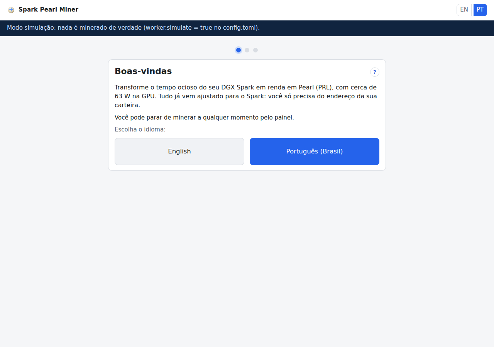

| Elemento | O que faz |
|---|---|
| **Boas-vindas** e o texto abaixo | uma apresentação curta: o minerador transforma o tempo ocioso do Spark em renda em Pearl (PRL), com cerca de 63 W na GPU, e você só precisa do endereço da sua carteira |
| "Você pode parar de minerar a qualquer momento pelo painel." | um lembrete; parar é um botão (veja [o botão principal](#main-button)) |
| **English** / **Português (Brasil)** | escolhe o idioma da GUI e vai para o passo 2. O botão do idioma do seu navegador vem destacado (azul) |

A escolha é salva como `gui.language` quando você clica em **Começar a minerar** no passo 3.

<a id="wizard-2"></a>
### Passo 2: Sua carteira

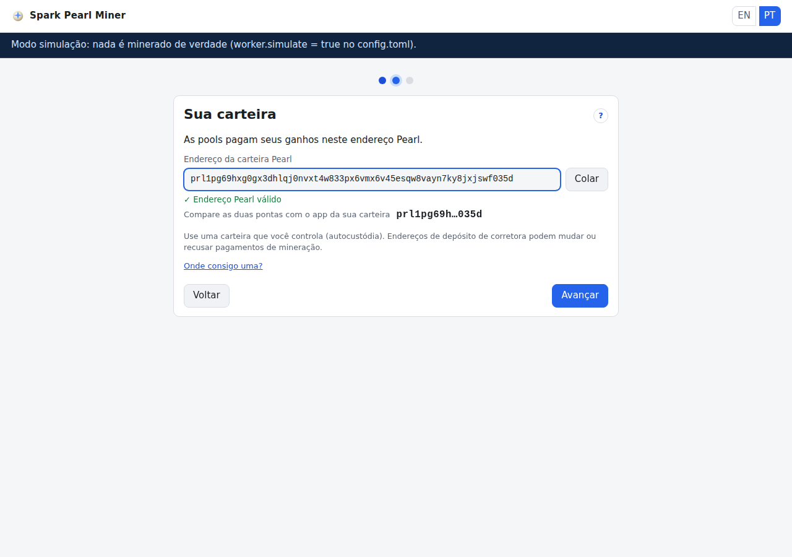

| Elemento | O que faz |
|---|---|
| Caixa **Endereço da carteira Pearl** | cole o endereço da sua carteira Pearl (`prl1p…`, 63 caracteres). Ele é verificado enquanto você digita |
| **Colar** | cola da área de transferência. Só aparece quando o navegador deixa a página ler a área de transferência |
| ✓ **Endereço Pearl válido** | o endereço passou em todas as verificações (formato, caracteres e checksum) |
| **Compare as duas pontas com o app da sua carteira** `prl1pxxxx…yyyy` | os 9 primeiros e os 4 últimos caracteres. Confira se batem com o que o app da carteira mostra: isso pega uma cópia errada ou um programa que troca endereços na área de transferência |
| "Use uma carteira que você controla (autocustódia)…" | endereços de depósito de corretora podem mudar ou recusar pagamentos de mineração; use uma carteira cujas chaves são suas |
| **Onde consigo uma?** | abre [a seção da carteira](#wallet) abaixo |
| **Voltar** / **Avançar** | **Avançar** fica cinza até o endereço ser válido |

Quando você sai da caixa, os espaços em volta do endereço são removidos e um endereço escrito em
maiúsculas é convertido para minúsculas (é o mesmo endereço).

Se você colar o próprio endereço da taxa do desenvolvedor, aparece a nota **"Esta é a carteira da
taxa do desenvolvedor: a taxa se desliga sozinha quando você minera para ela."**

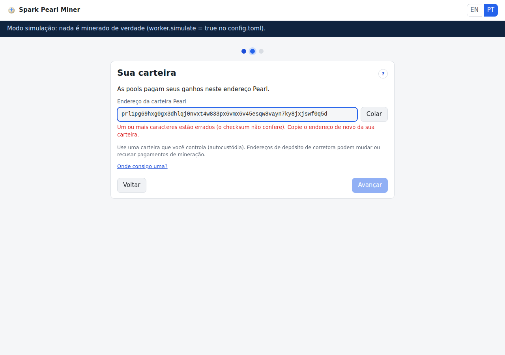

As mensagens em vermelho abaixo da caixa, e o que fazer:

| Mensagem | Significado / o que fazer |
|---|---|
| Informe o endereço da sua carteira Pearl. | a caixa está vazia |
| O endereço mistura letras maiúsculas e minúsculas. Copie de novo da sua carteira. | um endereço é todo em minúsculas ou todo em maiúsculas; copie de novo |
| Isto é mais longo que um endereço Pearl. Copie só o endereço. | provavelmente veio texto a mais junto |
| Isto não parece um endereço Pearl: ele precisa começar com prl1p | não é um endereço, ou falta o começo |
| Há um caractere que endereços Pearl nunca usam (b, i, o ou um símbolo). Copie o endereço de novo. | erro de digitação, ou um caractere acrescentado por um programa de chat ou e-mail |
| Um ou mais caracteres estão errados (o checksum não confere). Copie o endereço de novo da sua carteira. | o endereço foi alterado no caminho (a imagem acima mostra isso). Nunca digite um endereço à mão |
| Este é o endereço de outra moeda: um endereço Pearl começa com prl1p | por exemplo um endereço Bitcoin `bc1…` |
| Só endereços prl1p… são aceitos (este é outro tipo de endereço). | um endereço Pearl válido de outro tipo; use um endereço de recebimento normal (`prl1p…`) da sua carteira |
| O endereço tem o tamanho errado. Copie o endereço inteiro de novo. | falta um pedaço do endereço |

<a id="wallet"></a>
#### Onde consigo uma carteira?

Use a carteira oficial da Pearl (a carteira de desktop Oyster ou o `oystercli`) ou outra carteira
que lhe dê as chaves, e copie um dos endereços de recebimento dela (`prl1p…`). As pools pagam seus
ganhos direto nesse endereço, então ele precisa ser seu. Endereço de depósito de corretora é má
ideia: a corretora pode trocá-lo, e algumas recusam ou perdem pagamentos pequenos de mineração.

<a id="wizard-3"></a>
### Passo 3: Taxa do desenvolvedor e início

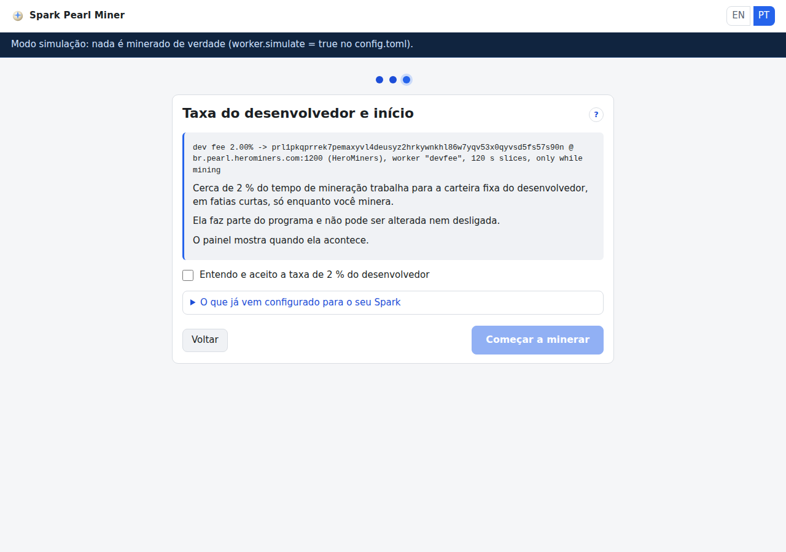

| Elemento | O que faz |
|---|---|
| A caixa cinza, primeira linha (letra pequena) | a linha exata da taxa compilada no programa: `dev fee 2.00% -> prl1pkqp…s90n @ br.pearl.herominers.com:1200 (HeroMiners), worker "devfee", 120 s slices, only while mining`. É a mesma linha do README (fica em inglês) |
| As três frases | cerca de 2 % do tempo de mineração trabalha para a carteira fixa do desenvolvedor, em fatias curtas, só enquanto você minera; ela faz parte do programa e não pode ser alterada nem desligada; o painel mostra quando ela acontece |
| **Entendo e aceito a taxa de 2 % do desenvolvedor** | obrigatório: **Começar a minerar** fica cinza até você marcar |
| **O que já vem configurado para o seu Spark** | uma caixa fechada; clique para ver os valores prontos (imagem abaixo) |
| **Voltar** / **Começar a minerar** | **Começar a minerar** salva e começa |

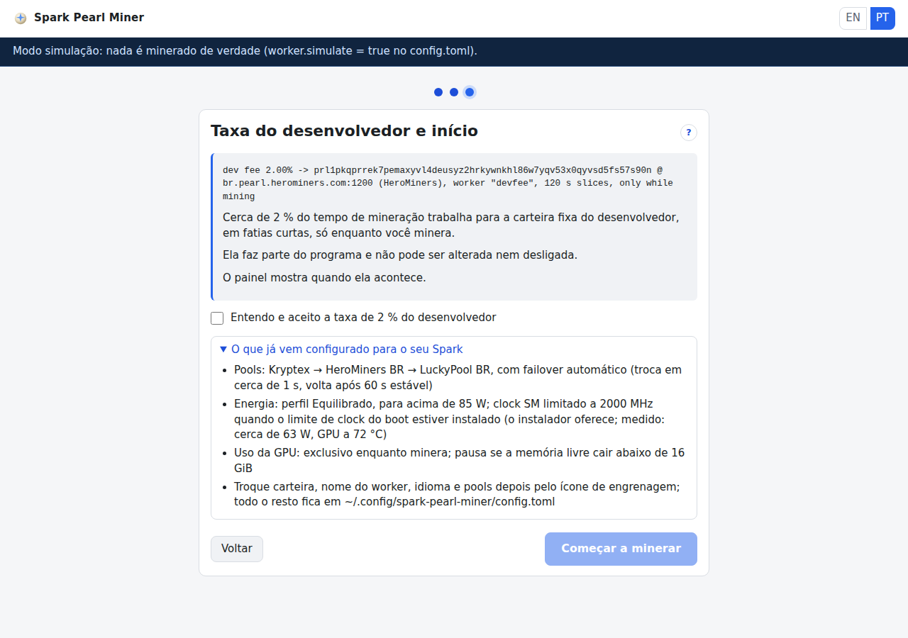

A caixa de valores prontos lista:

- **Pools:** Kryptex → HeroMiners BR → LuckyPool BR, com failover automático (troca em cerca de
  1 s, volta após 60 s estável);
- **Energia:** perfil Equilibrado, clock SM limitado a 2000 MHz, para acima de 85 W (medido: cerca
  de 63 W, GPU a 72 °C). Esse texto só aparece depois que o minerador viu o limite de clock em
  vigor. Até lá ele diz "…clock SM limitado a 2000 MHz quando o limite de clock do boot estiver
  instalado (o instalador oferece…)", porque o limite é um passo opcional do instalador (veja [as
  duas perguntas do instalador](#installer-questions));
- **Uso da GPU:** exclusivo enquanto minera; pausa se a memória livre cair abaixo de 16 GiB;
- troque carteira, nome do worker, idioma e pools depois pelo ícone de engrenagem; todo o resto fica
  em `~/.config/spark-pearl-miner/config.toml`.

Se o minerador já viu a GPU rodar acima de 2000 MHz, uma caixa amarela abaixo da caixa de valores
prontos diz **O limite de segurança de clock de 2000 MHz não está instalado. Instale uma vez com:**
`sudo ~/.local/share/spark-pearl-miner/install-clockcap.sh --apply`, com um botão **Copiar**.
Execute-o num terminal antes de clicar em **Começar a minerar**; o governador de energia continua
protegendo o Spark sem ele, mas o limite é a rede de segurança recomendada.

**O que Começar a minerar faz.** Lê as configurações atuais do minerador, muda só três coisas (sua
carteira, o aceite da taxa e o idioma), salva e começa a minerar. Enquanto isso o botão mostra
**Iniciando…**. Depois o painel abre com a mensagem **Mineração iniciada**. A partir daí o
minerador também volta a minerar sozinho depois de reiniciar o computador, até você clicar em
**Parar** (veja [o botão principal](#main-button)).

Se algo der errado:

| O que aparece | Significado / o que fazer |
|---|---|
| "Corrija isto antes de começar:" e uma lista acima dos botões | o minerador recusou um valor. Cada linha é uma frase simples com o nome da configuração em letra pequena (as mensagens estão em [Configurações › erros ao salvar](#save-errors)) |
| mensagem vermelha **Não foi possível salvar (HTTP {código}): {mensagem}** | não deu para salvar (por exemplo o serviço parou). Você continua no passo 3; clique em **Começar a minerar** de novo |
| mensagem vermelha **Não foi possível começar a minerar: {mensagem}** | as configurações foram salvas, mas a mineração não começou. O painel abre mesmo assim; clique em **Começar a minerar** lá |

<a id="dashboard"></a>
## 3. O painel

Depois da configuração a GUI tem uma página só, o painel. Ele responde três perguntas: **está
funcionando** (a frase grande), **quanto** (os cartões de taxa e de shares) e **está seguro** (o
cartão de energia). Ele se atualiza sozinho a cada segundo.

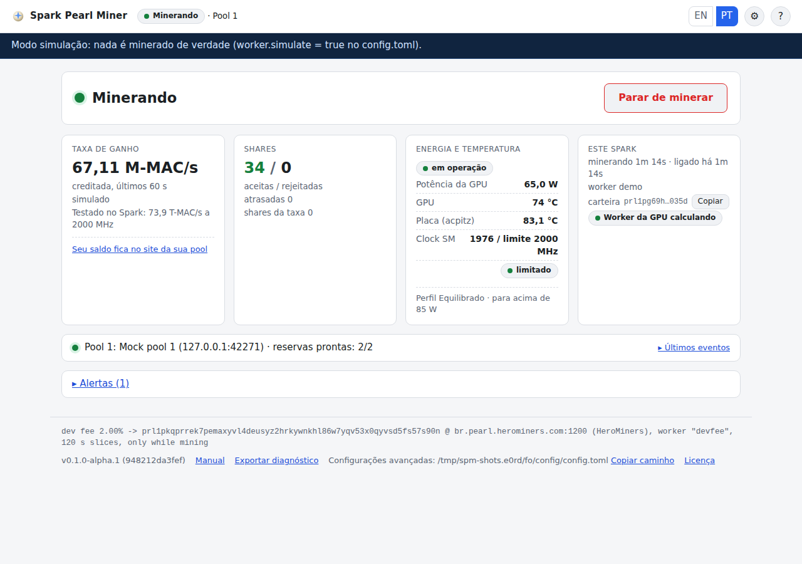

De cima para baixo: o cabeçalho, as faixas de aviso (só quando há algo a dizer), a frase grande com
o botão principal, quatro cartões, a linha da pool, os alertas (só quando há alertas) e o rodapé.

### 3.1 Cabeçalho

| Elemento | O que faz |
|---|---|
| **Spark Pearl Miner** | o nome |
| etiqueta de estado (por exemplo **● Minerando · Pool 1**) | o estado do minerador; minerando, ela acrescenta o número da pool em uso. Os valores estão na tabela abaixo |
| **EN / PT** | troca o idioma só deste navegador (o navegador lembra; o `gui.language` salvo só muda pela configuração inicial e pelas Configurações) |
| ⚙ (engrenagem) | abre o [diálogo de Configurações](#settings) |
| **?** | abre este manual |

Valores da etiqueta de estado:

| Etiqueta | Significado |
|---|---|
| Configuração pendente | nenhuma carteira salva, ou a taxa ainda não aceita (a configuração aparece no lugar) |
| Parado | você clicou em Parar (ou nunca clicou em Começar) |
| Iniciando | a mineração acabou de começar: conectando à pool e iniciando o worker da GPU |
| Minerando | trabalhando para uma pool (`· Pool n` diz qual) |
| Trocando de pool | a pool em uso falhou e o minerador está passando para a próxima |
| Nenhuma pool acessível | nenhuma pool responde; o minerador continua tentando |
| Pausado | a mineração está em espera por um motivo mostrado na frase grande |
| Sem conexão com o minerador | esta página perdeu o contato com o serviço (veja [mensagens](#toasts)) |

<a id="banners"></a>
### 3.2 Faixas de aviso

Faixas coloridas abaixo do cabeçalho. Só aparecem quando necessário.

| Faixa | Significado / o que fazer |
|---|---|
| **A carteira de pagamento foi alterada fora desta página (agora prl1pxxxx…yyyy). Foi você?** com **Sim, fui eu** e **Parar de minerar** | a carteira no `config.toml` mudou, mas não por esta página (uma edição à mão, um script ou outra pessoa). Se foi você, clique em **Sim, fui eu** (mensagem: *Obrigado: a troca de carteira foi confirmada*). Se não foi, clique em **Parar de minerar**, corrija a carteira em [Configurações](#settings) e descubra quem mexeu no arquivo (`~/.local/state/spark-pearl-miner/audit.log` registra toda mudança) |
| **Modo simulação: nada é minerado de verdade (worker.simulate = true no config.toml).** | o arquivo diz `worker.simulate = true`: roda a simulação na CPU em vez da GPU. Só para testes e para as imagens deste manual; volte para `false` (veja [arquivo avançado](#advanced-file)) |
| **Nenhuma GPU NVIDIA/runtime CUDA encontrada: não dá para minerar. Veja Manual › Solução de problemas.** | o worker da GPU não consegue rodar. Veja [solução de problemas](#troubleshooting) |
| **O limite de segurança de clock de 2000 MHz não está instalado. Instale uma vez com:** `sudo ~/.local/share/spark-pearl-miner/install-clockcap.sh --apply` (com botão **Copiar**) | falta o limite de clock da GPU aplicado no boot, então a GPU pode subir acima de 2000 MHz. O governador de energia continua protegendo o Spark, mas o limite é a rede de segurança recomendada. Execute o comando uma vez num terminal; ele pede a sua senha |
| **Falha de energia detectada ({falha}): mineração parada. Veja Manual › Falhas de energia.** (vermelha) | o governador de energia reconheceu um problema de hardware ou firmware e parou a mineração. Veja [falhas de energia](#power-faults) |

<a id="hero"></a>
### 3.3 A frase grande ("está funcionando?")

Uma frase com um ponto colorido: **verde** = minerando, **cinza** = parado, **azul** = esperando
algo normal, **âmbar** = em espera por segurança ou por um problema que talvez precise de atenção,
**vermelho** = parado por uma falha. Vale a primeira regra que combinar, nesta ordem:

| Frase | Ponto | Significado / o que fazer |
|---|---|---|
| Termine a configuração | âmbar | aparece só por um instante; a configuração abre sozinha |
| Parado | cinza | a mineração está desligada. Clique em **Começar a minerar** |
| Pausado por segurança: potência da GPU acima do limite de parada (volta em {n} s) | âmbar | a GPU consumiu mais que o limite de parada do perfil (85 W no Equilibrado) em 3 leituras seguidas. Volta sozinha depois de 60 s, subindo aos poucos |
| Pausado por segurança: GPU quente demais (volta em {n} s) | âmbar | a GPU passou de 83 °C. Volta depois de 60 s com a GPU a 78 °C ou menos e a placa a 90 °C ou menos. Verifique ventilação e poeira |
| Pausado por segurança: placa quente demais (volta em {n} s) | âmbar | o sensor da placa do Spark (`acpitz`) passou de 95 °C. Mesma regra; verifique a temperatura da sala e se nada cobre as saídas de ar |
| Pausado por segurança: falha de energia | âmbar | uma falha de energia está sendo tratada; veja [falhas de energia](#power-faults) |
| (as mesmas frases sem "volta em") | âmbar | a pausa espera uma condição, não um cronômetro |
| O worker da GPU parou após falhas repetidas: {mensagem} | vermelho | o worker da GPU falhou 3 vezes em 10 minutos. O botão vira **Tentar de novo**; veja [solução de problemas](#troubleshooting) |
| Parado: falha de energia detectada | vermelho | veja a faixa de falha de energia acima |
| Aguardando memória livre: {n} GiB livres, precisa de 22 GiB | âmbar | outros programas usam memória demais; a mineração começa sozinha quando houver 22 GiB livres |
| GPU liberada: a memória livre caiu abaixo de 16 GiB ({n} GiB livres) | âmbar | o minerador liberou a GPU para proteger seus outros programas; volta quando houver memória de novo |
| GPU liberada: pressão de memória acima de 10 % ({n} %) | âmbar | falta memória no sistema (PSI do Linux); igual ao anterior |
| Não foi possível ler o estado da memória: mineração segurada por segurança | âmbar | `/proc/meminfo` ou o PSI não podem ser lidos; não deveria acontecer no DGX OS |
| Pausado pela linha de comando (clique em Retomar) | âmbar | alguém executou `spark-pearl-miner pause`. O botão vira **Retomar** |
| Pausado por segurança pela proteção de energia | âmbar | uma parada de segurança sem mais detalhes |
| Pausado: sem leituras de energia da GPU | âmbar | o minerador não consegue ler a potência da GPU, então não minera (veja [solução de problemas](#troubleshooting)) |
| Aguardando memória livre | âmbar | a proteção de memória segura a mineração |
| Aguardando: outro programa está usando a GPU | azul | só nos modos de compartilhamento da GPU (`yield`): a mineração volta quando o outro programa estiver ocioso |
| A rede Pearl foi atualizada: atualize o minerador | âmbar | as pools mandam trabalho que esta versão não sabe fazer; [atualize](#update) |
| Todas as pools rejeitam as shares: atualize o minerador | âmbar | normalmente a mesma causa; [atualize](#update) |
| Pausado pela proteção de saúde | âmbar | uma verificação de segurança do minerador segura a mineração; veja os alertas |
| Worker da GPU iniciando | azul | normal por alguns segundos depois de Começar |
| Worker da GPU reiniciando em breve | azul | o worker parou e é reiniciado depois de uma espera curta |
| Aguardando o spark-modo iniciar o worker da GPU | azul | só com `coexistence.mode = "spark-modo"` |
| Conectando à pool… | azul | normal logo depois de Começar |
| Trocando da pool {a} para a pool {b} | azul | failover automático em andamento (cerca de 1 s) |
| Reconectando à pool {n} | azul | uma reconexão curta na mesma pool |
| Nenhuma pool acessível; tentando de novo | âmbar | nenhuma pool responde; veja [solução de problemas](#troubleshooting) |
| Minerando a fatia de 2 % da taxa do desenvolvedor (selo **taxa**) | verde | uma fatia curta da taxa (120 s) está rodando; a sua mineração continua logo depois |
| Minerando | verde | tudo certo |

<a id="main-button"></a>
### 3.4 O botão principal

Um botão à direita da frase. Ele muda com o estado:

| Botão | Quando | O que faz |
|---|---|---|
| **Começar a minerar** | parado | começa a minerar (mensagem: *Mineração iniciada*) |
| **Parar de minerar** | minerando, iniciando, esperando ou pausado por segurança | pede confirmação e então para (mensagem: *Mineração parada*) |
| **Retomar** | pausado pela linha de comando | retoma |
| **Tentar de novo** | depois de uma falha do worker da GPU ou de energia | começa de novo |

Enquanto o pedido roda, o botão fica desativado. Se falhar, uma mensagem vermelha diz **Não foi
possível {começar a minerar / parar de minerar / retomar}: {motivo}**.

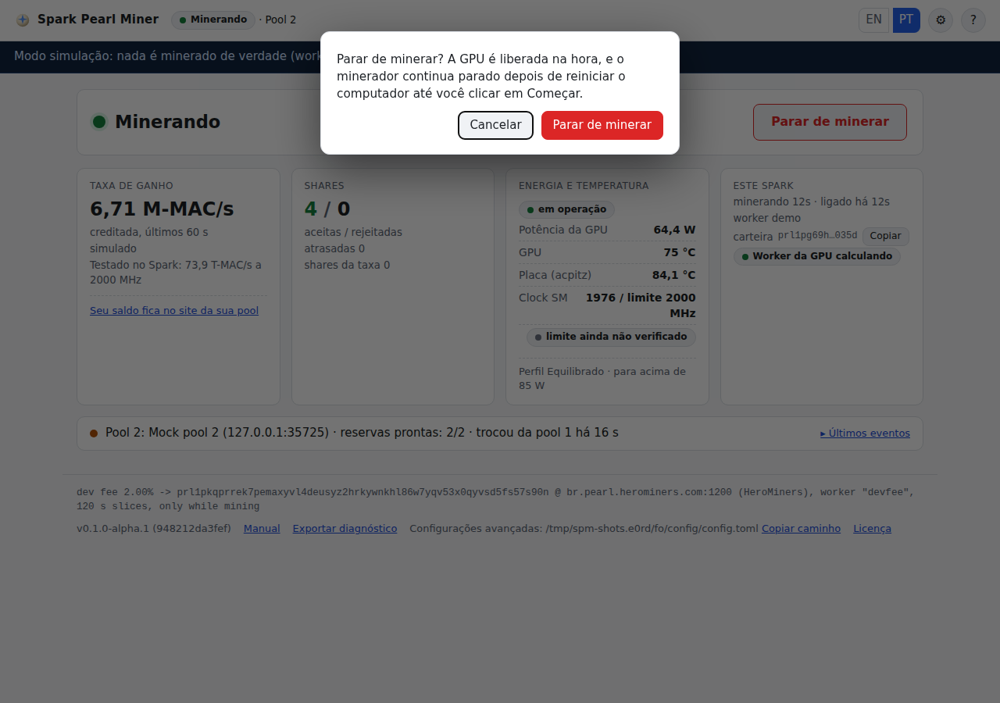

Parar pergunta: **"Parar de minerar? A GPU é liberada na hora, e o minerador continua parado depois
de reiniciar o computador até você clicar em Começar."** **Cancelar** continua minerando; **Parar de
minerar** para. Depois de parar, o worker da GPU é liberado, então a GPU e a memória dela ficam
livres para outro trabalho na hora.

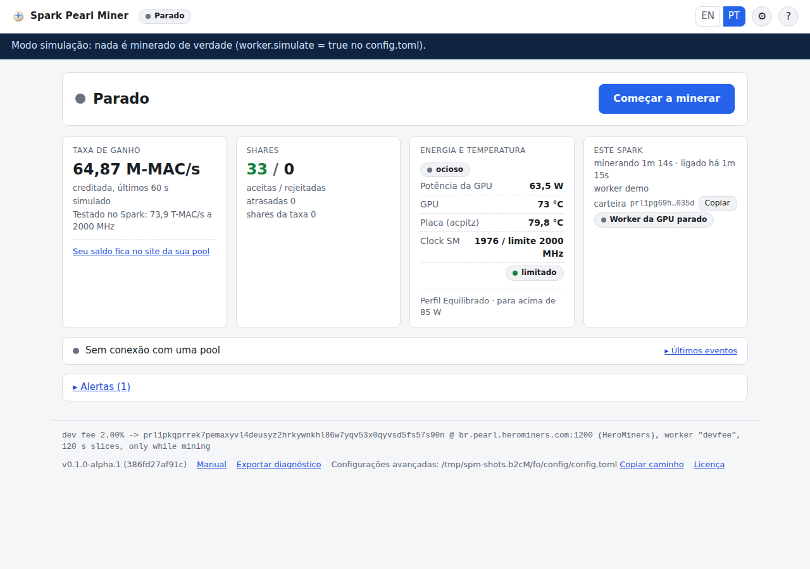

O minerador lembra a escolha: depois de reiniciar o computador ele só volta a minerar se estava
minerando antes. Não há botão de Pausa na GUI (pausar e retomar continuam na
[linha de comando](#cli)).

### 3.5 Cartão 1: Taxa de ganho ("quanto?")

| Elemento | Significado |
|---|---|
| número grande, ex. **73,9 T-MAC/s** | o trabalho creditado pela pool, na média dos últimos 60 s. 1 T-MAC/s é o que as pools chamam de 1 TH/s |
| creditada, últimos 60 s | como o número é medido |
| "Anda em degraus: a pool credita tentativas inteiras (7,04e13 MACs cada)." | o número pula em vez de mudar suavemente, porque cada tentativa concluída conta como um bloco de 7,04e13 MACs. Na simulação esta linha diz *simulado* |
| "Testado no Spark: 73,9 T-MAC/s a 2000 MHz" | a referência: o que um DGX Spark sustenta com o limite de clock padrão |
| **Seu saldo fica no site da sua pool** | abre [onde ver o seu saldo](#balance). A GUI nunca mostra uma estimativa de PRL por dia |

### 3.6 Cartão 2: Shares

| Elemento | Significado |
|---|---|
| **aceitas / rejeitadas**, ex. **152 / 0** | shares que as pools aceitaram (verde) e rejeitaram. Rejeitadas fica âmbar acima de 0 e vermelho quando passa de 10 % de pelo menos 10 aceitas |
| atrasadas {n} | shares que chegaram depois de a pool passar para um trabalho novo; algumas são normais |
| shares da taxa {n} | shares enviadas nas fatias da taxa do desenvolvedor (não contam acima) |
| dica (passe o mouse no cartão) | {n} descartadas antes do envio (trabalho antigo ou falha na checagem local). Toda share é verificada neste computador antes de ser enviada |

Uma share rejeitada também gera uma mensagem: **Share rejeitada pela pool {n}: {motivo}**.

### 3.7 Cartão 3: Energia e temperatura ("está seguro?")

| Linha | Normal | Âmbar | Vermelho |
|---|---|---|---|
| Potência da GPU | abaixo do alvo | no alvo ou acima (75 W no Equilibrado, menos com a GPU quente) | no limite de parada ou acima (85 W no Equilibrado): vem uma pausa |
| GPU (temperatura) | abaixo de 78 °C | 78 °C ou mais (o governador baixa o alvo 3 W por °C) | 83 °C ou mais: pausa |
| Placa (acpitz) | abaixo de 90 °C | 90 °C ou mais | 95 °C ou mais: pausa |
| Clock SM | `{clock} / limite {limite} MHz` | | |

Etiquetas no cartão:

| Etiqueta | Significado |
|---|---|
| **limitado** | o limite de clock de 2000 MHz do boot está aplicado |
| **sem limite** | o clock passou do limite: o limite não está instalado (a faixa de aviso mostra o comando) |
| **limite ainda não verificado** | o minerador ainda não viu 30 s de carga total, então não dá para saber |
| estado do governador: **em operação**, **ocioso**, **parada de segurança**, **falha**, **sem leituras**, **governador desligado** | o que o governador de energia está fazendo: controlando a GPU, nada a controlar, uma pausa de segurança, uma falha, sem telemetria, inativo |

Rodapé do cartão: **Perfil Equilibrado · para acima de 85 W**, mais **· paradas até agora: {n}**
depois de uma pausa de segurança e **· perfil rebaixado** quando o minerador roda um perfil abaixo
porque a execução anterior terminou mal (um travamento ou uma queda de energia). Sem leituras o
cartão diz **Sem leituras de energia: mineração segurada por segurança**.

### 3.8 Cartão 4: Este Spark

| Elemento | Significado |
|---|---|
| minerando {tempo} · ligado há {tempo} | tempo minerando, e tempo desde que o serviço começou |
| worker {nome} | o nome do worker que as pools mostram (`spark` por padrão) |
| carteira `prl1pxxxx…yyyy` **Copiar** | sua carteira de pagamento, abreviada; **Copiar** copia o endereço inteiro (mensagem: *Copiado*) |
| etiqueta do worker da GPU | Worker da GPU parado / iniciando / pronto / calculando / pausado / reiniciando em breve / aguardando o spark-modo iniciar o worker da GPU / parado (falha) / nenhum worker de GPU disponível |

<a id="failover-line"></a>
### 3.9 A linha da pool (failover automático)

Uma linha abaixo dos cartões mostra qual pool está em uso e se as reservas estão prontas. As pools
são configuradas em [Configurações](#settings): **Principal** é a pool 1, **Reserva 1** é a pool 2,
**Reserva 2** é a pool 3.

| Linha | Ponto | Significado |
|---|---|---|
| Pool 1: Kryptex (prl-br.kryptex.network:8048) · reservas prontas: 2/2 | verde | normal: minerando na pool principal, as duas reservas utilizáveis |
| Pool 2: … · trocou da pool 1 há {tempo} | âmbar | a pool principal falhou e o minerador passou para uma reserva (imagem abaixo). É automático; nada a fazer |
| … · verificando a pool 1 para voltar (após 60 s estável) | âmbar | a pool principal voltou a responder; o minerador volta para ela depois de 60 s saudável |
| … · pool {k}: {motivo}, nova tentativa em {n} s | | uma pool que falhou, por quê (os motivos estão em [resultados do Testar](#check-results)) e quando será tentada de novo |
| … · fixada | | uma pool foi fixada pela linha de comando ou pela API; o failover não sai dela |
| Nenhuma pool acessível, tentando de novo em {n} s | vermelho | todas as pools falharam; veja [solução de problemas](#troubleshooting) |
| Sem conexão com uma pool | cinza | parado, ou ainda não conectado |

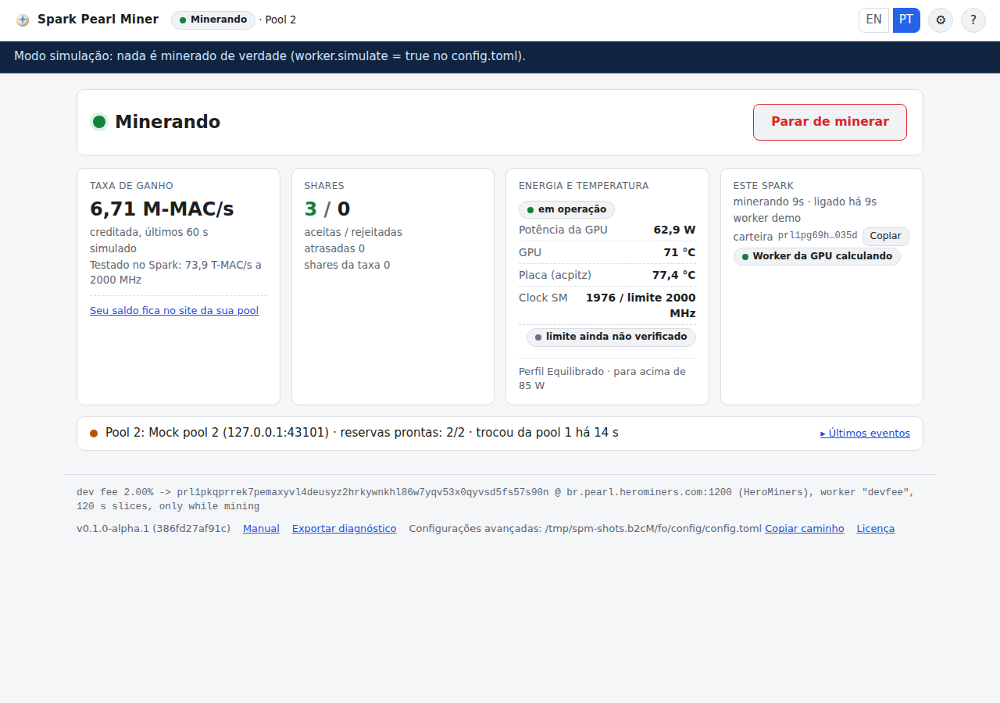

Clique na linha (ou em **▸ Últimos eventos**) para ver os 5 últimos eventos, do mais novo para o
mais antigo, com o horário local:

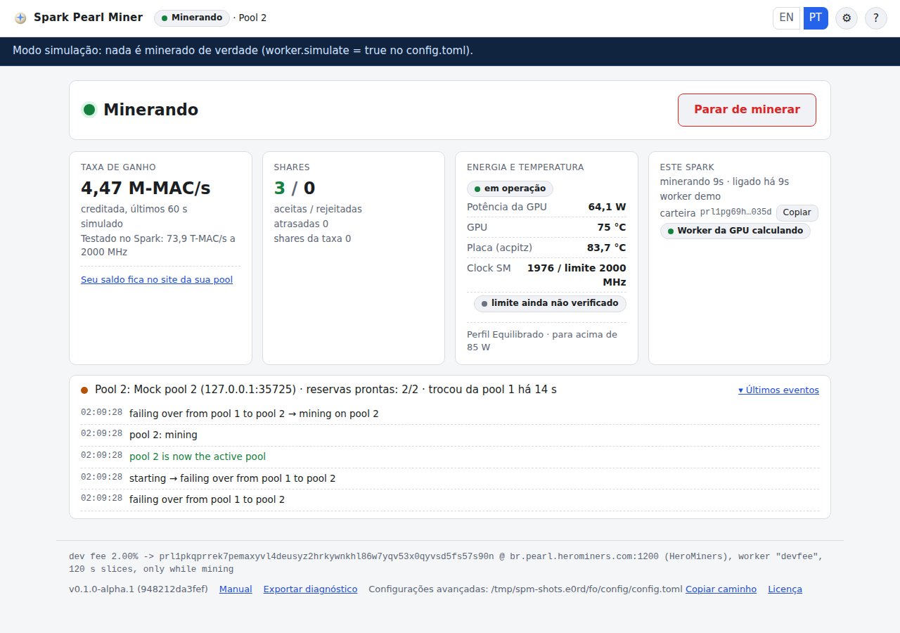

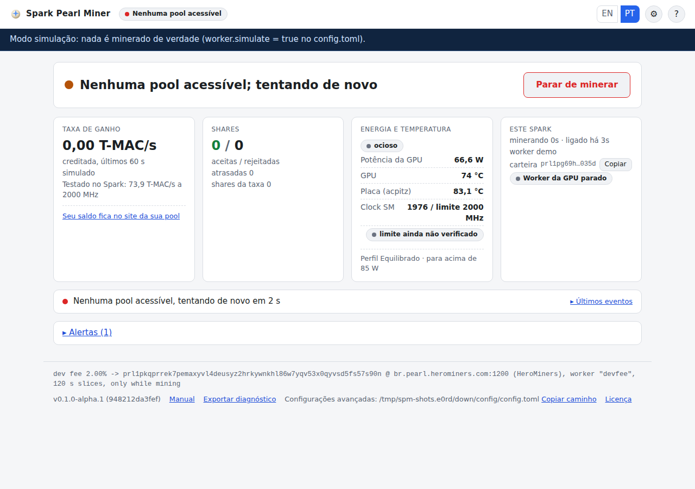

Aqui não há botões: trocar ou fixar uma pool à mão é feito pela [linha de comando](#cli).

<a id="alerts"></a>
### 3.10 Alertas

Quando o minerador tem algo a relatar, aparece uma linha **▸ Alertas ({n})**. Clique para ver os 10
últimos alertas, do mais novo para o mais antigo, com o horário: ⚠ para aviso, ✖ para erro.

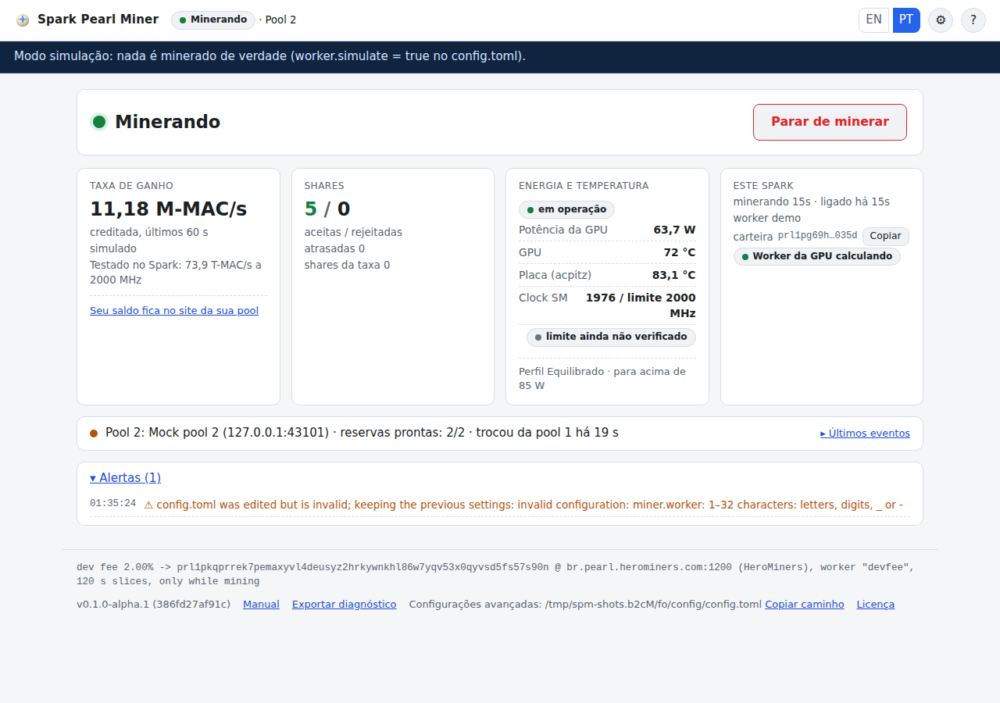

Um comum é **"config.toml was edited but is invalid; keeping the previous settings: …"** (os alertas
vêm do serviço e ficam em inglês): o arquivo de configurações foi editado à mão com um erro. O
minerador continua trabalhando com as configurações anteriores; corrija o arquivo (veja [o arquivo
avançado](#advanced-file)).

<a id="toasts"></a>
### 3.11 Mensagens (avisos rápidos)

Mensagens curtas que aparecem num canto e somem sozinhas:

| Mensagem | Quando |
|---|---|
| Mineração iniciada | depois de Começar, Retomar ou Tentar de novo |
| Mineração parada | depois de Parar |
| Não foi possível {começar a minerar / parar de minerar / retomar}: {motivo} | um botão falhou |
| Configurações salvas | as Configurações foram salvas |
| Configurações salvas: reinicie o minerador para aplicar {configurações} (com o comando `systemctl --user restart spark-pearl-miner` e **Copiar**) | uma mudança salva precisa de reinício (só configurações de `[api]`) |
| Não foi possível salvar (HTTP {código}): {mensagem} | salvar falhou |
| Obrigado: a troca de carteira foi confirmada | depois de **Sim, fui eu** |
| Copiado | um botão Copiar funcionou |
| Não foi possível copiar: selecione o texto e copie à mão | o navegador bloqueou a área de transferência |
| Diagnóstico salvo (endereços de carteira ocultados) | depois de **Exportar diagnóstico** |
| Share rejeitada pela pool {n}: {motivo} | uma pool rejeitou uma share |
| (o texto de um alerta) | um alerta novo, âmbar para aviso e vermelho para erro |
| Reconectando ao minerador… | a página perdeu o contato com o serviço |

Quando o contato fica perdido por mais de 10 s, um painel cobre a página: **"Sem contato com o
minerador. O serviço está rodando? Execute: spark-pearl-miner status (ele também mostra erros do
config.toml)."** Ele some sozinho quando o serviço volta a responder.

<a id="footer"></a>
### 3.12 Rodapé

| Elemento | O que faz |
|---|---|
| a linha da taxa (letra pequena) | a mesma linha da taxa compilada da configuração inicial, sempre visível |
| v0.1.0-alpha.1 (commit) | a versão do programa |
| **Manual** | abre este manual |
| **Exportar diagnóstico** | baixa um arquivo JSON para suporte: versão, estado, pools, configurações e as últimas 5000 linhas de log, com os endereços de carteira abreviados para `prl1…xxxx` |
| **Configurações avançadas: {caminho}** e **Copiar caminho** | onde fica o [arquivo de configurações](#advanced-file) |
| **Licença** | a licença Apache-2.0 |

<a id="settings"></a>
## 4. O diálogo de Configurações

O ícone de engrenagem no cabeçalho abre o diálogo. Ele guarda as quatro coisas que você pode querer
mudar depois da configuração inicial: carteira, nome do worker, idioma e pools.

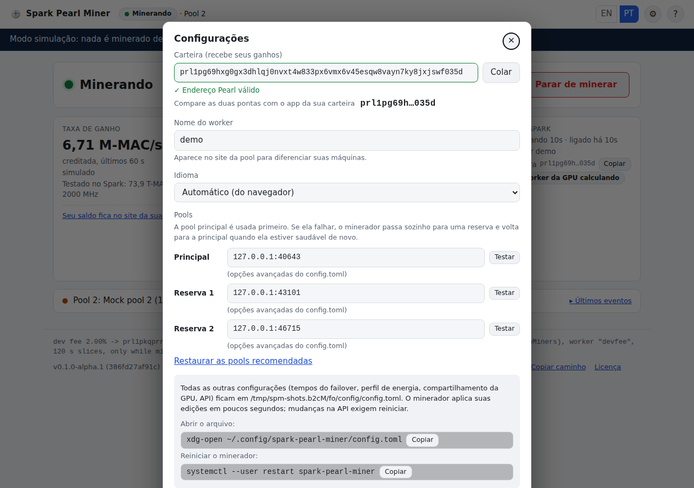

| Campo | Regras / o que faz |
|---|---|
| **Carteira (recebe seus ganhos)** | a mesma caixa, verificações e mensagens do [passo 2](#wizard-2), com **Colar** e as pontas abreviadas |
| **Nome do worker** | de 1 a 32 letras, números, `_` ou `-` (padrão `spark`). "Aparece no site da pool para diferenciar suas máquinas." Senão: *Use de 1 a 32 letras, números, _ ou -.* |
| **Idioma** | Automático (do navegador) / English / Português (Brasil) |
| **Pools**: **Principal**, **Reserva 1**, **Reserva 2** | uma caixa `host:porta` por pool, em ordem de prioridade (veja abaixo) |
| **Restaurar as pools recomendadas** | preenche as três linhas com Kryptex → HeroMiners BR → LuckyPool BR (só é salvo quando você clica em Salvar) |
| a caixa cinza | "Todas as outras configurações (tempos do failover, perfil de energia, compartilhamento da GPU, API) ficam em {caminho}. O minerador aplica suas edições em poucos segundos; mudanças na API exigem reiniciar." com botões **Copiar** para `xdg-open ~/.config/spark-pearl-miner/config.toml` e `systemctl --user restart spark-pearl-miner` |
| ✕ / **Cancelar** / Esc | fecha sem salvar |
| **Salvar** | salva (mostra **Salvando…**) e fecha quando dá certo |

<a id="pool-rows"></a>
### 4.1 As linhas de pool

"A pool principal é usada primeiro. Se ela falhar, o minerador passa sozinho para uma reserva e
volta para a principal quando ela estiver saudável de novo."

- Digite `host:porta` (por exemplo `prl-br.kryptex.network:8048`), ou escolha na lista que abre
  quando você clica na caixa. A lista tem as pools testadas (Kryptex, HeroMiners BR, LuckyPool BR)
  e outras conhecidas marcadas **(não verificada)** (HeroMiners US, US2, DE, FR e LuckyPool EU).
- Um endereço IPv6 vai entre colchetes: `[2001:db8::1]:3333`.
- Deixe uma linha vazia para não usá-la. Pelo menos uma linha precisa estar preenchida.
- **O que é mantido.** Uma pool tem opções ocultas (modo TLS, chave de certificado fixada, dialeto
  do protocolo, senha…). Se uma linha continua com o mesmo `host:porta` de antes, todas as opções
  dela ficam como estão no `config.toml`. Se você digitar uma pool testada, as opções testadas dela
  são usadas. Qualquer outra coisa é uma pool nova com opções automáticas (TLS auto, dialeto auto,
  senha `x`).
- **(opções avançadas do config.toml)** abaixo de uma linha quer dizer que aquela pool tem opções
  diferentes das automáticas (por exemplo o certificado fixado da LuckyPool). Elas são mantidas
  enquanto você não redigitar a linha.

Mensagens numa linha:

| Mensagem | Significado |
|---|---|
| Use host:porta, por exemplo prl-br.kryptex.network:8048 (porta de 1 a 65535). | o texto não é um `host:porta` válido |
| Esta pool já está na lista acima. | a mesma pool duas vezes |
| Mantenha pelo menos uma pool | as três linhas estão vazias |

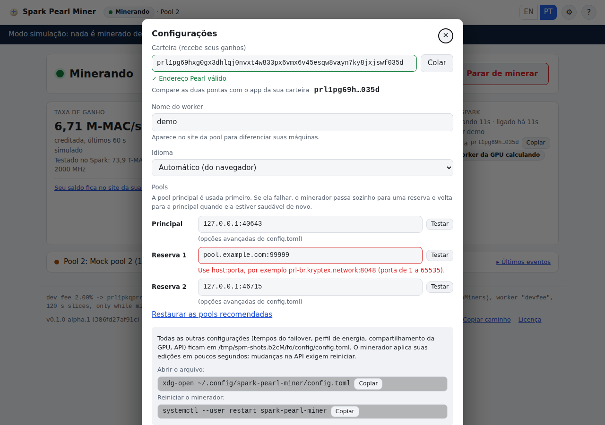

<a id="check-results"></a>
### 4.2 O botão Testar

**Testar** verifica a pool daquela linha: busca do nome (DNS), conexão e TLS. Nunca faz login e
nunca envia share. Mostra **Testando…**, depois **✓ Acessível ({n} ms)** ou um destes motivos (os
mesmos motivos aparecem na [linha da pool](#failover-line) quando uma pool falha):

| Motivo | O que fazer |
|---|---|
| Não foi possível encontrar o nome da pool (DNS). Confira o host e sua conexão com a internet. | corrija o nome do host, verifique a internet |
| O DNS não respondeu a tempo. | verifique a internet ou o servidor DNS |
| A pool recusou a conexão (porta errada ou pool fora do ar). | confira a porta no site da pool |
| Não foi possível alcançar a pool (rede inacessível ou conexão reiniciada). | verifique a rede, o firewall ou a VPN |
| A pool não respondeu a tempo. | a pool ou a rede está lenta ou fora; tente depois |
| O certificado TLS da pool não é confiável. | a pool usa certificado autoassinado: precisa de `tls = "pinned"` e `spki_pin` no `config.toml` |
| A chave da pool não confere com a chave fixada: a pool trocou o certificado ou há alguém no meio. Sem conexão. | confira os avisos da pool antes de mudar o `spki_pin` |
| A pool não fala TLS nesta porta. | use a porta TLS da pool, ou `tls = "off"` no `config.toml` |
| O handshake TLS demorou demais. | tente depois |
| As configurações de TLS desta pool são inválidas (confira a chave fixada no config.toml). | corrija o `spki_pin` no arquivo |
| A pool recusou o login. Confira o endereço da carteira e o nome do worker. | aparece para uma pool que falha (não no Testar) |
| A pool não respondeu ao login. / Login feito, mas a pool não enviou trabalho. / A pool fechou a conexão. / Erro de conexão. / A pool enviou uma mensagem grande demais. / A pool enviou algo que não é stratum/JSON válido. / Fechada pelo minerador. | problemas do lado da pool; o minerador faz o failover sozinho |
| Shares demais rejeitadas como inválidas nesta pool. / Shares atrasadas demais nesta pool. / A pool parou de responder às shares. | a pool sai pelo failover; se acontecer em todas, [atualize](#update) |
| A pool diz que este minerador está banido; aguardando antes de tentar de novo. | a pool é pulada por 10 minutos |
| Sem trabalho novo há muito tempo, mesmo após reconectar. | a pool travou; o minerador faz o failover |
| A rede foi atualizada: esta versão do minerador não consegue minerá-la. Atualize o minerador. | [atualize](#update) |
| Host ou porta inválidos. / Defina primeiro uma carteira e um nome de worker válidos. | corrija a linha ou os campos de carteira/worker |

<a id="wallet-change"></a>
### 4.3 Trocando a carteira

Se você trocou a carteira, **Salvar** pergunta antes **"Trocar a carteira que recebe seus ganhos
para prl1pxxxx…yyyy?"**. Compare as pontas com o app da carteira e clique em **Trocar carteira** (ou
**Cancelar**).

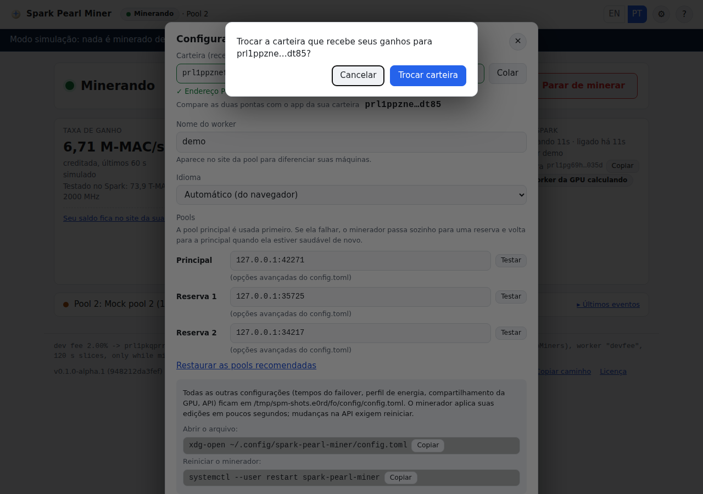

<a id="save-errors"></a>
### 4.4 Resultados e erros ao salvar

- **Configurações salvas**: pronto; o minerador aplica a mudança em segundos (uma lista de pools
  nova ou uma carteira nova reconecta as pools).
- **Configurações salvas: reinicie o minerador para aplicar …**: só configurações de `[api]`
  precisam de reinício; a mensagem traz o comando e um botão **Copiar**.
- **Corrija os campos destacados primeiro.**: um campo ou uma linha está em vermelho; nada foi
  salvo.
- **Não foi possível salvar (HTTP {código}): {mensagem}**: o serviço não aceitou ou não respondeu.

Se o minerador recusar um valor, a mensagem aparece junto do campo ou da linha correspondente:

| Mensagem | Significado |
|---|---|
| Informe o endereço da sua carteira Pearl. / O endereço da carteira não é um endereço Pearl válido (prl1p…). | carteira |
| O nome do worker só pode ter de 1 a 32 letras, números, _ ou -. | nome do worker |
| Mantenha pelo menos uma pool. / No máximo 3 pools. | pools |
| O host da pool não é um nome de host ou endereço IP válido. / A porta precisa estar entre 1 e 65535. | uma linha de pool |
| Esta pool precisa da chave fixada (edite no config.toml). / Há uma chave fixada, mas o TLS não é "pinned" (corrija no config.toml). | as opções TLS ocultas de uma pool |
| A senha da pool é inválida (corrija no config.toml). / O rótulo da pool é longo demais (corrija no config.toml). | outras opções ocultas da pool |
| Um valor do config.toml está fora da faixa permitida. | um valor avançado no arquivo |
| O perfil de energia Máximo exige max_acknowledged = true no config.toml. | veja [o perfil de energia](#power-profile) |
| O endereço de métricas do vLLM precisa ser uma URL http:// simples. | `coexistence.metrics_url` num modo yield |
| A GUI só escuta neste computador (127.0.0.1). / O endereço da API não é um endereço IP. / O acesso pela rede local não pode ser ligado. | `[api]` no arquivo |
| Idioma desconhecido. | `gui.language` |
| O config.toml foi escrito por outra versão do minerador. | `schema_version`; [atualize](#update) |
| Não foi possível ler as configurações. | o arquivo não é TOML válido |
| A taxa do desenvolvedor não é configurável. | alguém pôs no arquivo uma chave parecida com configuração de taxa; remova |

<a id="login"></a>
## 5. A tela de login

Normalmente você nunca a vê: no Spark, a conta de usuário que roda o minerador entra sem senha. A
tela de login só aparece quando:

- você abre a GUI de **outra conta de usuário** no mesmo Spark;
- você usa um túnel ou proxy que roda com outro usuário; ou
- `api.trust_local_user = false` está no arquivo de configurações (token para todos, inclusive você).

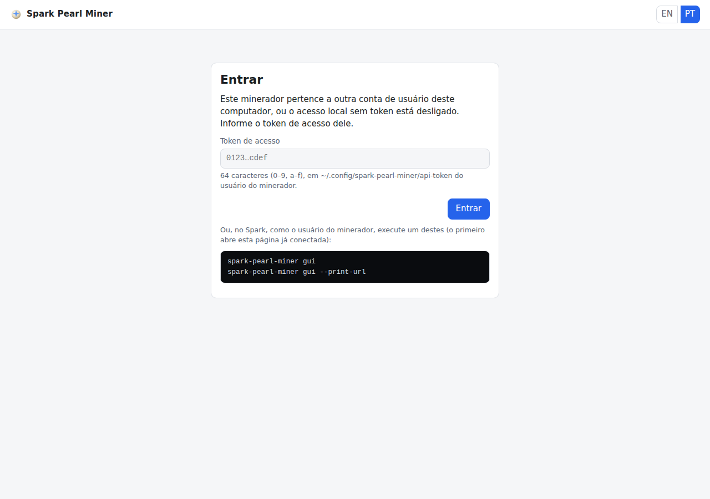

| Elemento | O que faz |
|---|---|
| **Token de acesso** | 64 caracteres (0–9, a–f), no arquivo `~/.config/spark-pearl-miner/api-token` da conta que roda o minerador. Cole e clique em **Entrar** ou tecle Enter |
| `spark-pearl-miner gui` | executado no Spark com o usuário do minerador: abre a GUI já conectada |
| `spark-pearl-miner gui --print-url` | imprime um link com o token depois de `#token=`. Abrir o link faz o login e tira o token da barra de endereço (a parte depois do `#` nunca vai pela rede) |

Mensagens: **Este token não é aceito. Copie de novo do arquivo api-token.** (token errado), **Sem
contato com o minerador. O serviço está rodando? Execute: spark-pearl-miner status** (sem resposta)
e **Sua sessão terminou (o minerador reiniciou?). Entre de novo.** (depois de o serviço reiniciar).

Quem consegue ler o arquivo do token controla o minerador: não o compartilhe.

<a id="advanced-file"></a>
## 6. O arquivo de configurações avançadas

Não existe página avançada na GUI. Tudo o que a GUI não mostra fica em um arquivo só:

**`~/.config/spark-pearl-miner/config.toml`**

Ele é criado pelo minerador na primeira vez que roda, já ajustado para o DGX Spark, com um
comentário acima de cada configuração (significado, unidade, faixa e o valor testado; os
comentários são em inglês). **Você não precisa editá-lo.** Mexa nele só para uma das
[receitas](#recipes) abaixo ou se o suporte pedir.

- **Abrir:** `xdg-open ~/.config/spark-pearl-miner/config.toml` (ou `nano` num terminal).
  `spark-pearl-miner config path` imprime o caminho exato.
- **Aplicar edições:** salve o arquivo; o minerador o lê de novo em poucos segundos (ele verifica a
  cada 2 s). Mudanças em `[api]` exigem `systemctl --user restart spark-pearl-miner`.
- **Um erro não estraga nada:** uma edição inválida é ignorada, as configurações anteriores
  continuam valendo, e um alerta diz por quê (veja [Alertas](#alerts)).
  `spark-pearl-miner config check` imprime `OK: <caminho>` ou uma linha `configuração: problema`
  por erro.
- **Na partida:** se o arquivo estiver inválido quando o serviço começa, o serviço não sobe.
  `spark-pearl-miner status` então mostra os erros abaixo de "The miner is not running", e o
  `journalctl --user -u spark-pearl-miner` também.
- **Seus próprios comentários não são mantidos:** todo salvamento pela GUI reescreve o arquivo com
  os comentários padrão. Guarde anotações em outro lugar.
- Cada salvamento guarda o arquivo anterior como `config.toml.bak` (modo 0600), e toda mudança fica
  registrada em `~/.local/state/spark-pearl-miner/audit.log`.
- A taxa do desenvolvedor não está no arquivo e não pode ser acrescentada: chaves parecidas com taxa
  são recusadas.

<a id="recipes"></a>
### 6.1 Receitas

**Compartilhar a GPU com um servidor de IA (vLLM).** Por padrão a GPU é do minerador enquanto ele
minera; clique em Parar quando precisar da GPU. Para o minerador sair da frente sozinho enquanto o
vLLM estiver ocupado:

```toml
[coexistence]
mode = "yield"            # ou "yield-release" para liberar também a memória de GPU do worker
metrics_url = "http://127.0.0.1:8001/metrics"   # o endereço de métricas do seu vLLM
```

Detalhes: [COEXISTENCIA.md](COEXISTENCIA.md).

<a id="power-profile"></a>
**Um Spark mais silencioso e frio (Eco).** Coloque `profile = "eco"` em `[power]` (alvo 60 W,
parada 70 W) e instale o limite de clock em 1800 MHz:
`sudo ~/.local/share/spark-pearl-miner/install-clockcap.sh --apply --mhz 1800`.

**Por que não o Máximo.** `profile = "max"` (alvo 88 W, parada 92 W, 2200 MHz) fica dentro da
faixa em que o DGX Spark sabidamente desliga (~88–92 W). Neste hardware ele mediu 83–87 W e a placa
a 97,5 °C, acima da parada de segurança de 95 °C. Ele é recusado sem `max_acknowledged = true`; não
é recomendado.

**Uma pool própria com certificado fixado.** Digite `host:porta` em [Configurações](#settings),
salve e depois acrescente as opções TLS àquela entrada `[[pools]]` no arquivo:

```toml
tls = "pinned"
spki_pin = "<SHA-256 em base64 da chave pública da pool>"
```

**Exigir o token até para você.** Em `[api]` coloque `trust_local_user = false` e execute
`systemctl --user restart spark-pearl-miner`. A GUI passa a mostrar a [tela de login](#login).

### 6.2 Cada configuração, o valor pronto e quando mexer

**Básico** (também na GUI):

| Configuração | Valor pronto | Quando mexer |
|---|---|---|
| `schema_version` | `1` | nunca |
| `miner.wallet` | `""` (definido na configuração inicial) | use a GUI |
| `miner.worker` | `"spark"` | use a GUI |
| `miner.disclosure_accepted` | `false` (definido na configuração inicial) | nunca à mão |
| `gui.language` | `"auto"` | use a GUI |
| `[[pools]]` ×3 | Kryptex, HeroMiners BR, LuckyPool BR | host e porta na GUI |
| `pools.name` | nome da pool | um rótulo para a GUI e os logs (até 40 caracteres) |
| `pools.tls` | Kryptex `on`, HeroMiners `auto`, LuckyPool `pinned` | só para uma pool própria (`on`, `off`, `auto`, `pinned`) |
| `pools.spki_pin` | a chave da LuckyPool | só com `tls = "pinned"` |
| `pools.dialect` | Kryptex `kryptex-v2` (provas em gzip, como a Kryptex pede; volta para plain sozinho), HeroMiners `auto`, LuckyPool `object` | só se uma pool própria precisar (`auto`, `object`, `kryptex`, `kryptex-v2`) |
| `pools.jsonrpc` | `auto` (LuckyPool `on`) | só se uma pool precisar (`auto`, `on`, `off`) |
| `pools.proof` | `auto` | nunca (o minerador aprende a codificação certa) |
| `pools.password` | `"x"` | se a pool pedir (a Kryptex também aceita `d=<dificuldade>`) |
| `pools.login` | não definido | para entrar só nessa pool com uma conta em vez da carteira, por exemplo o seu ID da Kryptex (`krx…`) para a Kryptex pagar em BTC. O nome do worker continua sendo acrescentado; as outras pools seguem com a carteira, e a taxa do desenvolvedor não muda |
| `pools.pattern` | `"auto"` | nunca, a não ser que uma pool rejeite todas as shares (`official`) |
| `pools.enabled` | `true` | `false` mantém a entrada sem usá-la |

**Avançado: `[failover]`** (testado: failover em cerca de 1 s, volta após 60 s estável). Não mexa, a
não ser que o suporte de uma pool peça.

| Configuração | Valor pronto | Significado |
|---|---|---|
| `connect_timeout_s` | 10 | segundos para a busca do nome e para a conexão, cada |
| `handshake_timeout_s` | 15 | segundos para o TLS e o login |
| `first_job_timeout_s` | 30 | segundos esperando o primeiro trabalho depois do login |
| `stall_soft_reconnect_s` | 900 | segundos sem trabalho novo antes de uma reconexão, depois um failover |
| `max_consecutive_invalid` | 5 | shares inválidas seguidas que derrubam a pool |
| `reject_ratio_max` / `reject_window` | 0,5 / 20 | fração de rejeições nas últimas shares que derruba a pool |
| `stale_ratio_max` / `stale_window` | 0,02 / 100 | fração de shares atrasadas nas últimas shares que derruba a pool |
| `submit_ack_timeout_s` / `max_ack_timeouts` | 30 / 3 | shares sem resposta que derrubam a pool |
| `backoff_s` | 5, 10, 20, 40, 80, 120 | esperas antes de tentar de novo uma pool que falhou |
| `backoff_jitter_pct` | 20 | ± porcentagem aleatória em cada espera |
| `failback_probe_every_s` | 300 | de quanto em quanto tempo uma pool principal recuperada é sondada |
| `failback_stable_s` | 60 | quanto tempo ela precisa ficar saudável antes de o minerador voltar para ela |
| `auth_retry_s` | 600 | tentar de novo uma pool que recusou o login depois deste tempo |
| `quarantine_s` | 600 | pular por este tempo uma pool que diz que o minerador está banido |
| `drain_s` | 5 | a pool antiga ainda recebe as shares em andamento depois de uma troca planejada |
| `reconnect_same_after_s` | 60 | uma pool que minerou mais do que isso ganha uma reconexão antes do failover |

**Avançado: `[power]`**

| Configuração | Valor pronto | Quando mexer |
|---|---|---|
| `profile` | `"balanced"` (alvo 75 W, parada 85 W, limite 2000 MHz; medido: cerca de 63 W, GPU a 72 °C, 73,9 T-MAC/s) | `"eco"` para um Spark mais silencioso; `"max"` não é recomendado |
| `max_acknowledged` | `false` | só com `profile = "max"` |

Embutido (não são configurações): 10 leituras por segundo; o alvo cai 3 W por °C acima de 78 °C;
pausa com a GPU a 83 °C, a placa a 95 °C, ou 3 leituras acima da parada (60 s); sem leituras de
energia, não minera.

**Avançado: `[coexistence]`**

| Configuração | Valor pronto | Quando mexer |
|---|---|---|
| `mode` | `"exclusive"` | `"yield"` / `"yield-release"` para dividir a GPU com o vLLM; `"spark-modo"` só com a integração spark-modo |
| `metrics_url` | `"http://127.0.0.1:8001/metrics"` | o endereço de métricas do seu vLLM (só nos modos yield) |
| `poll_ms` | 200 | nunca |
| `idle_s` | 5 | segundos que o vLLM precisa ficar ocioso antes de a mineração voltar |
| `busy_sm_pct` | 10 | nunca |

Embutido: o worker precisa de 22 GiB de memória livre para começar e libera a GPU abaixo de 16 GiB
ou acima de 10 % de pressão de memória.

**Avançado: `[worker]`**

| Configuração | Valor pronto | Quando mexer |
|---|---|---|
| `launch` | `"spawn"` | nunca (o spark-modo põe `external` sozinho) |
| `simulate` | `false` | nunca num minerador de verdade (`true` = simulação na CPU para testes e imagens) |
| `sim_interval_ms` | 1000 | só com `simulate = true` |

**Avançado: `[api]`** (exige reiniciar)

| Configuração | Valor pronto | Quando mexer |
|---|---|---|
| `bind` | `"127.0.0.1"` | nunca (só endereços de loopback são aceitos) |
| `port` | 4078 | só se outro programa usar a 4078 |
| `lan` | `false` | não pode ser ligado |
| `trust_local_user` | `true` | `false` para exigir o token também de você |

Todas as chaves, com a faixa exata: [CONFIGURACAO.md](CONFIGURACAO.md).

<a id="cli"></a>
## 7. Equivalentes na linha de comando

Algumas coisas ficam fora da GUI de propósito. Elas estão disponíveis num terminal no Spark:

| Tarefa | Comando |
|---|---|
| estado (acrescente `--json` para os dados brutos) | `spark-pearl-miner status` |
| começar / parar | `spark-pearl-miner start` / `spark-pearl-miner stop` |
| pausar / retomar (as pools continuam conectadas) | `spark-pearl-miner pause` / `spark-pearl-miner resume` |
| verificar o arquivo de configurações | `spark-pearl-miner config check` |
| onde fica o arquivo de configurações | `spark-pearl-miner config path` |
| link para outra conta ou um túnel | `spark-pearl-miner gui --print-url` |
| log ao vivo | `journalctl --user -u spark-pearl-miner -f` |
| detalhes e medições da taxa | `curl -s http://127.0.0.1:4078/api/v1/fee` |
| versão, commit e hash das constantes da taxa | `spark-pearl-miner --version` |
| comando do limite de clock | `spark-pearl-miner install-clock-cap` (imprime, não muda nada) |

As leituras (`GET`) respondem ao seu próprio usuário sem token. Trocar ou fixar uma pool exige uma
sessão (o token) e o valor CSRF:

```bash
JAR=$(mktemp)
TOKEN=$(cat ~/.config/spark-pearl-miner/api-token)
CSRF=$(curl -s -c "$JAR" -H 'Content-Type: application/json' -d "{\"token\":\"$TOKEN\"}" \
  http://127.0.0.1:4078/api/v1/session | python3 -c 'import sys,json;print(json.load(sys.stdin)["csrf"])')
# trocar agora para a pool 2 (isso também a fixa):
curl -s -b "$JAR" -H "X-SPM-CSRF: $CSRF" -H 'Content-Type: application/json' -d '{}' \
  http://127.0.0.1:4078/api/v1/pools/2/switch
# soltar, para o failover e a volta automática funcionarem de novo:
curl -s -b "$JAR" -H "X-SPM-CSRF: $CSRF" -H 'Content-Type: application/json' -d '{"pinned":false}' \
  http://127.0.0.1:4078/api/v1/pools/2/pin
rm -f "$JAR"
```

A API completa: [GUI.md](GUI.md).

<a id="balance"></a>
## 8. Onde ver o seu saldo

O minerador não guarda nem conta suas moedas: as pools pagam direto na sua carteira. Para ver saldo
e pagamentos, abra o site da sua pool e procure o endereço da sua carteira (`prl1p…`) lá; o nome do
worker (`spark`, se você não mudou) aparece na lista de workers.

| Pool | Site |
|---|---|
| Kryptex | https://pool.kryptex.com/ (Pearl, depois procure a sua carteira) |
| HeroMiners | https://pearl.herominers.com/ (cole a carteira na caixa de estatísticas) |
| LuckyPool | https://luckypool.io/ (Pearl, depois procure a sua carteira) |

O que aparece lá já desconta a taxa da própria pool. Pode ficar diferente do painel por um tempo:
as pools fazem médias de horas e só pagam acima de um valor mínimo. A GUI nunca estima PRL por dia,
porque isso depende da dificuldade da rede e muda todo dia.

<a id="troubleshooting"></a>
## 9. Solução de problemas

**A página não abre / "Sem contato com o minerador".** Execute `spark-pearl-miner status`. Se ele
disser que o minerador não está rodando, também mostra os erros das configurações, se houver.
Inicie o serviço com `systemctl --user start spark-pearl-miner` e leia
`journalctl --user -u spark-pearl-miner -n 50`.

**config.toml inválido.** Com o serviço rodando, uma edição inválida é ignorada e aparece em
[Alertas](#alerts). Na partida, um arquivo inválido impede o serviço de subir: execute
`spark-pearl-miner config check`, corrija as linhas indicadas (ou restaure o `config.toml.bak`) e
depois `systemctl --user restart spark-pearl-miner`.

**Memória insuficiente.** "Aguardando memória livre" quer dizer que outros programas (normalmente um
modelo de IA) ocupam a memória. A mineração começa sozinha quando houver 22 GiB livres; pare o
outro programa ou deixe como está.

**Uma pausa de segurança.** "Pausado por segurança: …" é o governador de energia fazendo o trabalho
dele; volta sozinho. Se acontecer muito: limpe as saídas de ar, dê espaço ao Spark, confira se o
limite de clock está instalado (o cartão 3 mostra **limitado**) ou use o perfil Eco.

**Limite de clock não instalado.** Execute uma vez
`sudo ~/.local/share/spark-pearl-miner/install-clockcap.sh --apply`. Para remover:
`sudo ~/.local/share/spark-pearl-miner/uninstall-clockcap.sh --apply`.

**O worker da GPU parou após falhas repetidas.** Clique em **Tentar de novo**. Se falhar de novo,
execute `nvidia-smi` (a GPU precisa aparecer), veja `journalctl --user -u spark-pearl-miner -n 100` e
mande o arquivo do **Exportar diagnóstico** junto com o relato.

**Nenhuma GPU NVIDIA/runtime CUDA encontrada.** O DGX Spark vem com o driver e o CUDA 13. Confira
`nvidia-smi` e `ldconfig -p | grep libcudart.so.13`; depois de atualizar o DGX OS, reinicie.

**Sem leituras de energia.** O minerador lê a potência pelo NVML (ou `nvidia-smi`). Sem leituras ele
não minera, por segurança. Confira se o `nvidia-smi` funciona; reinicie se ele travar.

<a id="power-faults"></a>
**Falhas de energia.** Uma faixa vermelha "Falha de energia detectada" cita um de três padrões:

| Nome na faixa | O que significa | O que fazer |
|---|---|---|
| alimentação USB-C (power delivery) | a negociação com a fonte falhou; o Spark roda com energia reduzida | desligue e religue o Spark com a fonte USB-C e o cabo originais ligados direto na tomada (sem hub, dock ou extensão) |
| modo de segurança da GPU | o modo de segurança do firmware prende a GPU em cerca de 30 W | desligue e religue a frio; se voltar, fale com o suporte da NVIDIA |
| limite térmico de 100 W | algo segura a GPU em 100 W | veja o que mais usa a GPU (`nvidia-smi`) |

A mineração fica parada até você clicar em **Tentar de novo**. Detalhes:
[ENERGIA-TERMICA.md](ENERGIA-TERMICA.md) §6–7.

**Nenhuma pool acessível.** Verifique a internet (`ping 8.8.8.8`) e clique em **Testar** em cada
linha das [Configurações](#settings) para ver o motivo. Se só algumas pools falham, o minerador
continua minerando nas outras.

<a id="update"></a>
## 10. Atualizar, voltar versão e desinstalar

O instalador guarda uma cópia de si mesmo em `~/.local/share/spark-pearl-miner/`.

<a id="installer-questions"></a>
**As duas perguntas do instalador.** Antes de iniciar o serviço, o instalador faz duas perguntas
que pedem a sua senha uma vez (`sudo`). Apertar Enter responde **Sim**:

| Pergunta | O que Sim faz | Se você responder Não |
|---|---|---|
| Instalar o limite de clock da GPU de 2000 MHz (recomendado)? | executa `sudo ~/.local/share/spark-pearl-miner/install-clockcap.sh --apply`: o clock do SM fica em 2000 MHz ou menos agora e em todo boot (cerca de 63 W, longe do desligamento em ~88–92 W) | a GPU fica sem limite; só o governador de energia a protege. O resumo, o último passo da configuração e o painel mostram o comando até você executá-lo |
| Continuar minerando depois que você sair da sessão e começar no boot, antes de você entrar? | executa `sudo loginctl enable-linger $USER` | o minerador só roda enquanto você está logado; execute o comando depois se mudar de ideia |

`--yes` responde sim às duas, `--no-sudo` pula as duas, e quando não há terminal para perguntar
(por exemplo `ssh` sem `-t`) as duas são puladas. O resumo no final sempre mostra o estado do
limite de clock e do lingering. `--dry-run` imprime os comandos e não executa nenhum.

| Tarefa | Comando | Observações |
|---|---|---|
| atualizar | `~/.local/share/spark-pearl-miner/install.sh --upgrade` | configurações, carteira e token são mantidos; a mineração volta se estava rodando. Se a versão nova recusar o seu `config.toml`, a antiga é recolocada |
| voltar para a versão anterior | `~/.local/share/spark-pearl-miner/install.sh --rollback` | troca pelo binário guardado na última atualização |
| desinstalar | `~/.local/share/spark-pearl-miner/install.sh --uninstall` | mantém `~/.config/spark-pearl-miner` (carteira, token) |
| desinstalar e apagar as configurações | `~/.local/share/spark-pearl-miner/install.sh --uninstall --purge` | pede para você digitar `delete` antes |

O desinstalador não remove o limite de clock (ele imprime os comandos `sudo`) e deixa o lingering
ligado (ele imprime `sudo loginctl disable-linger $USER`), porque outros serviços podem precisar.
